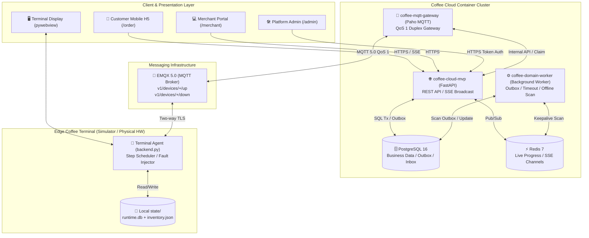
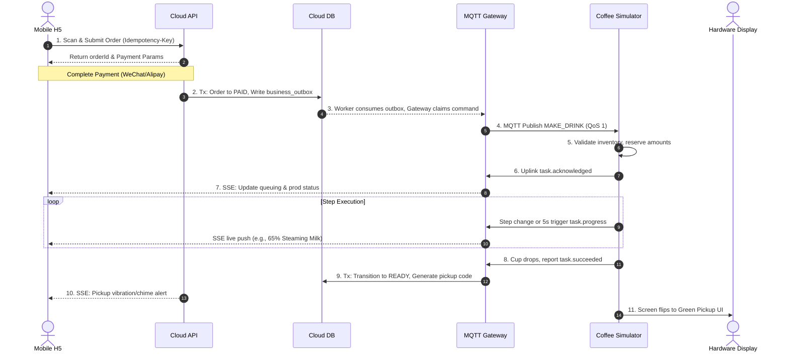
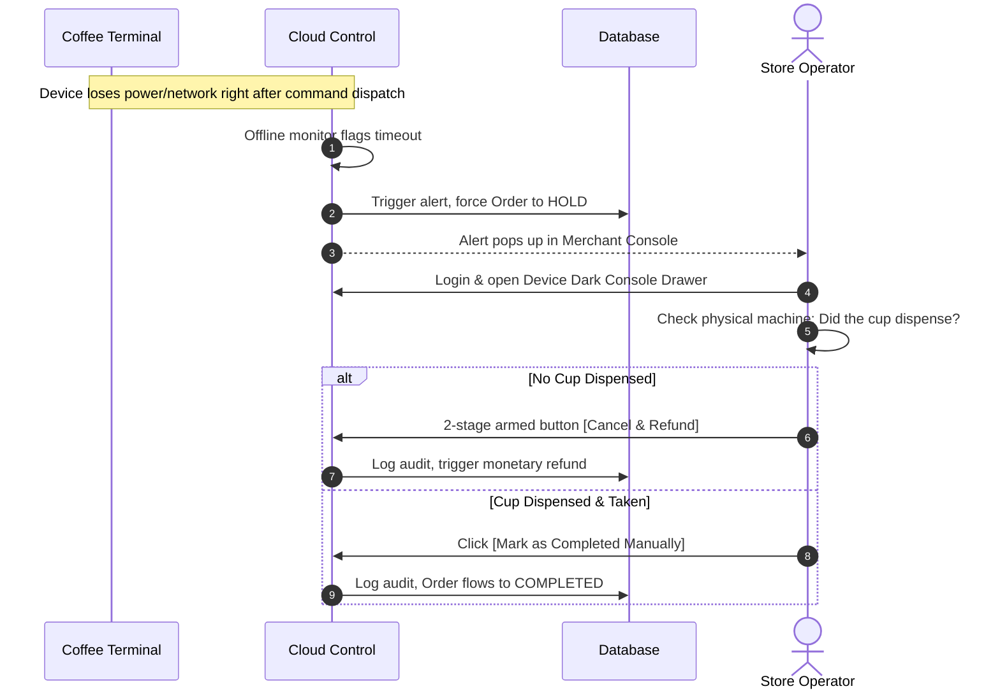

# Coffee Cloud MVP

> 中文版本: [README.zh-CN.md](README.zh-CN.md) · [Documentation Index](docs/README.md)

An industrial-grade operational backend and control plane for AI-driven automated coffee vending terminals. The current version (`0.4.0-production-grade`) ships a robust order-to-payment lifecycle, a PostgreSQL-backed Transactional Outbox, a multi-device MQTT 5.0 Gateway, automated MQTT credential provisioning, and a `HOLD` state circuit-breaker for uncertain physical hardware outcomes.

This repository holds the cloud platform. The companion edge terminal simulator resides in `coffee-terminal-simulator`. The system leverages a modular monolith architecture with FastAPI, PostgreSQL, and decoupled Gateway/Worker processes. A1/A2 versions are already deployed on VPS, database migrations are applied, and it supports Alipay integration with sandbox debugging.

---

## Table of Contents
1. [Overall Vision & Design Philosophy](#1-overall-vision--design-philosophy)
2. [System Architecture & Topology](#2-system-architecture--topology)
3. [Codebase Structure](#3-codebase-structure)
4. [Core State Machines & Inventory](#4-core-state-machines--inventory)
5. [Key Sequence Diagrams](#5-key-sequence-diagrams)
6. [Core Operations Loop & API Routes](#6-core-operations-loop--api-routes)
7. [Developer Guide](#7-developer-guide)
8. [Ops Runbook & Deployment](#8-ops-runbook--deployment)
9. [Current Boundaries & Roadmap](#9-current-boundaries--roadmap)

---

## 1. Overall Vision & Design Philosophy

**Coffee Cloud** and the **Terminal Simulator** provide an integrated hardware-software management platform designed for autonomous vending robots. The core mission is to construct an operationally sound and financially safe business system despite highly unreliable network constraints and hardware realities.

### Core Design Philosophy

1. **Embracing Uncertainty in Distributed Environments**: In IoT and hardware control contexts, network jitter, process restarts, or power losses are routine. We avoid the naïve assumption that "a successful command dispatch equals successful execution." The system relies heavily on the **Transactional Outbox** pattern to ensure eventual consistency between database states and external message delivery. Combined with At-Least-Once delivery and strict business-level idempotency, we ensure messages are neither lost nor duplicated after recovery.
2. **Hardware as the Source of Truth**: The cloud does not make complex physical inferences. Whether inventory is deducted or an action is completed depends solely on event payloads reported by the device itself.
3. **Financial Safety & The HOLD State**: If a command is dispatched but the device loses connection, we cannot know if the coffee was physically dispensed. In this scenario, the order enters a `HOLD` state for manual intervention. The system will *never* automatically refund an order with an unknown physical outcome, preventing monetary loss (the "customer gets the coffee and the refund" problem). Automatic refunds are strictly limited to orders that timed out while still queued in the system and were never dispatched to the hardware.

---

## 2. System Architecture & Topology



### Three Primary Communication Channels
1. **Control Downlink (Cloud → Edge)**: Topic `v1/devices/{deviceId}/down` (QoS 1). Carries high-risk/production commands like `MAKE_DRINK`, `CLEAN`, `RESTART_APP`, `RELOAD_CONFIG`.
2. **Telemetry & Event Uplink (Edge → Cloud)**: Topic `v1/devices/{deviceId}/up` (QoS 1). Transmits heartbeats, production progress (`task.progress`), and physical hardware events.
3. **Customer Live Push (Cloud → Mobile)**: HTTP Server-Sent Events (SSE) at `/api/v1/public/orders/{orderId}/events`. Leverages PG `LISTEN/NOTIFY` and Redis caching for millisecond-level synchronization of UI progress rings.

---

## 3. Codebase Structure

The architecture follows a modular monolith approach: `Route → Application Service → Repository → PostgreSQL`.

### Cloud Platform (`coffee-cloud-mvp/`)
```
coffee-cloud-mvp/
├── app/
│   ├── main.py                 # FastAPI Entrypoint: Routes, Exception Handlers, Lifespan
│   ├── settings.py             # Config: Pydantic type-validated env vars
│   ├── database.py             # Database Engine: PostgreSQL pooling & schema migrations
│   ├── protocol.py             # Contracts: MQTT Payload Schema, regex & tz validation
│   ├── order_logic.py          # Pure functions: State mapping, menu compute, online checks
│   ├── order_events.py         # SSE channel encoding & multiplexing
│   ├── payment_service.py      # Payments: Idempotent callbacks, Transactional Outbox
│   ├── payment_providers.py    # Channel Adapter Abstraction: Mock / Alipay / WeChat
│   ├── production_state.py     # Production FSM: Command legitimacy & state transitions
│   ├── live_progress.py        # High-frequency progress aggregation over Redis
│   ├── mqtt_gateway.py         # Standalone: Multi-device MQTT 5.0 I/O gateway
│   ├── domain_worker.py        # Standalone: Outbox asynchronous consumer & scanner
│   ├── emqx_provisioner.py     # EMQX interop: Dynamic MQTT credentials & ACLs
│   ├── merchant/               # B-side Domain: Organizations, Inventory, RBAC
│   ├── repositories/           # Repository: Raw SQL encapsulation
│   └── services/               # Services: Transactions & Dispatch
├── public/                     # Frontend Vanilla JS SPA (OpenDesign spec)
│   ├── order.html / order.js   # Mobile scan-to-order & payment waiting page
│   ├── merchant.html / .js     # Merchant ops console (Console Dark Surface)
│   └── shared/coffee-ui.css    # Global design tokens and UI components
├── tests/                      # Smoke & Contract Tests (Node.js) + Unit Tests (pytest)
├── compose.yaml                # Production Docker Compose orchestration
└── Dockerfile                  # Python 3.12 multi-stage production image
```

The accompanying simulator (`coffee-terminal-simulator/`) includes a built-in display powered by `pywebview`, local inventory state persistence, and a controllable fault injection model.

---

## 4. Core State Machines & Inventory

### 4.1 Order Lifecycle & Risk Control
```text
CREATED → PENDING_PAYMENT → PAID → QUEUED → DISPATCHED → ACCEPTED → MAKING → READY
   └──────────────→ CANCELLED / EXPIRED / FAILED
                                      FAILED → REFUNDED
   └──────────────→ UNKNOWN → HOLD (Requires Manual Resolution)
```
- **ACCEPTED**: Hardware validated the recipe version and successfully locked inventory.
- **MAKING**: Device reports periodic progress; Cloud updates Redis and broadcasts SSE.
- **HOLD**: Order locked due to edge network disconnects post-dispatch. Auto-refunds are explicitly blocked to prevent stock loss. Customers can only cancel orders in `QUEUED`; web cancellations are rejected post-dispatch.

### 4.2 Tri-State Shared Inventory Control
Multiple recipes consume shared beans, milk, water, and syrup. To prevent overselling:
1. **Reserve (reserved)**: Instantly reserve the total cup amount into `reserved` upon order acceptance. If `onHand - reserved < 0`, the order is rejected.
2. **Deduct (On-Hand Deduction)**: Deduct both `onHand` and `reserved` only when the specific execution step is reached. `taskId:stepId:attempt` is used as an idempotent key to prevent double deduction on retries.
3. **Release**: When a task completes or cancels, any unconsumed `reserved` inventory is released, preventing permanent deadlocks.

---

## 5. Key Sequence Diagrams

### 5.1 End-to-End Order, Payment & Production



### 5.2 Hardware Fault & HOLD Resolution



---

## 6. Core Operations Loop & API Routes

### Environment URLs
- **Mobile Ordering**: `https://coffee-api.woodbridge.top/order?device_id=coffee-bot-002`
- **Order Status**: Auto-redirects to `/order/status#order=...&token=...` (tokens in fragment are not logged).
- **Admin/Merchant Console**: `https://coffee-api.woodbridge.top/admin`
- **OpenAPI Docs**: `https://coffee-api.woodbridge.top/docs`
- **Readiness Probe**: `https://coffee-api.woodbridge.top/ready` (debounced DB check).

### Core Rules
- **Idempotency Constraints**: Order creation, payments, and refunds must carry an `Idempotency-Key` header. Identical payload returns the original result; conflicting payload returns `409 Conflict`.
- **Payment Isolation**: Controlled by `PUBLIC_PAYMENT_MODE` (`TEST_FREE` / `ONLINE`). Unpaid orders are not dispatched online; callbacks only confirm the ledger and write to the Transactional Outbox, surviving process crashes.
- **Dynamic QR Codes**: Terminals display dynamic HTTPS links to avoid spoofing statically printed codes.

### RBAC (Role-Based Access Control)
- `VIEWER`: Read-only access to devices and order lists.
- `OPERATOR`: Can register devices and dispatch safe remote resets.
- `MANAGER`: Can initiate refunds, resolve HOLD orders, and view audits.
- `OWNER`: Tenant super-admin; issues Tokens and modifies roles.

All admin calls require `Authorization: Bearer <TOKEN>`. Tokens are displayed once at creation. High-risk actions log to `audit_log`.

---

## 7. Developer Guide

### 7.1 Adding a New Recipe & Inventory
Expand drinks **without backend Python code changes**. Create a new JSON config in `coffee-terminal-simulator/config/{deviceId}/recipes/` (e.g., `vanilla_latte.json`), specifying step durations, variances, and material consumption.
Execute `curl -X POST http://127.0.0.1:9101/device/v1/config/reload`. The terminal uploads a new capability snapshot, and the cloud menu updates instantly.

### 7.2 Extending Hardware Commands
1. Add the enum (e.g., `CALIBRATE_SCALE`) to `CommandCreateRequest` in `app/protocol.py`.
2. Add a two-stage armed button in `public/merchant.js` using `makeArmedButton` and dispatch via `sendDeviceCommandFlow`.
3. Register the execution handle in `COMMAND_HANDLERS` inside the simulator's `backend.py`.

### 7.3 Integrating Third-Party Payments
Extend the `PaymentProvider` abstract class in `app/payment_providers.py` to provide unified payment creation, callback signature verification, and refunds. Mount the webhook, and the underlying Outbox guarantees single-ledger reconciliation.

### 7.4 Automated Testing Standards
Run the 100% smoke and test suite before submitting modifications:
```bash
# Setup dependency environment
uv venv --managed-python --python 3.12 .venv
uv pip install --python .venv/bin/python -r requirements-dev.lock

# 1. Cloud Node Contract Tests (Frontend & Contracts)
node --test tests/*.mjs

# 2. Cloud Python Domain Logic Tests
.venv/bin/pytest -q

# 3. Export new OpenAPI specs
.venv/bin/python scripts/export_openapi.py
```

---

## 8. Ops Runbook & Deployment

### 8.1 Docker Compose Orchestration
The project uses `compose.yaml` to isolate constraints:
- `coffee-cloud-mvp` (768M, API & Frontend, low I/O blocks).
- `coffee-mqtt-gateway` (256M, MQTT thread pool with a self-healing Supervisor; requires stable `MQTT_GATEWAY_ID`).
- `coffee-domain-worker` (512M, Outbox scanner and timeout auditor; lock-based singleton).

```bash
# Backup old database
docker exec postgres-web pg_dump -U coffee_cloud -Fc coffee_cloud_mvp > coffee-cloud-before-upgrade.dump

# Build and deploy
docker compose up -d --build
docker compose ps
docker compose logs -f --tail=100 coffee-mqtt-gateway
```
Execute schema migrations safely via the standalone tool container:
```bash
docker compose --profile tools run --rm coffee-db-migrate
```

### 8.2 Environment Variables (`.env`)
Crucial variables must be mounted from `.env` or Docker secrets (never committed):
- `DATABASE_URL`: PostgreSQL connection string.
- `ORDER_ACCESS_SECRET`: HMAC private key for sensitive order pages. **Must be uniquely set in production and never shared with ADMIN_TOKEN.**
- `ALIPAY_GATEWAY` / `ALIPAY_APP_ID`: Alipay routing & key paths.
- `MQTT_GATEWAY_ID`: Multi-instance deployments require unique Paho Session IDs to avoid kick loops.
- `TELEMETRY_REDIS_URL`: Redis connection handling high-frequency heartbeats; falls back to SQL if unavailable.
- `EMQX_MANAGEMENT_URL`: Internal address for EMQX HTTP admin API to dynamically provision ACLs.

### 8.3 MQTT Gateway Lifecycle & Health Checks
- The gateway uses `clean_start=False` with a 7-day session expiry (604800s) to guarantee QoS 1 offline queue delivery.
- A `Supervisor` thread manages disconnects using a jittered exponential backoff. Deadlocks halt writes to `/tmp/mqtt-gateway.json`, triggering an automatic Docker `unhealthy` container restart.

### 8.4 Device Activation & Provisioning
1. Admins register devices in `/admin` to generate a one-time activation code.
2. Field engineers execute the activation script on the device:
```bash
.venv/bin/python scripts/activate_instance.py coffee-bot-003 \
  --activation-code-file .secrets/coffee-bot-003.activation-code \
  --secrets-file .secrets/coffee-bot-003.env

# Launch the instance
./start-instance.command coffee-bot-003 --env-file .secrets/coffee-bot-003.env
```
During activation, `emqx_provisioner.py` pushes independent MQTTS credentials and ACL rules to the EMQX Broker, neutralizing spoofing attacks at the root.

---

## 9. Current Boundaries & Roadmap

Architectural red lines: No physical dispatch before payment, purely serial multi-drink queuing per machine, persistent Inbox deduplication for all device events, and strict isolation of secret files.

**Upcoming Priorities (as of 2026-08-30)**:
1. **Live Payment Cutover**: Finalize Alipay sandbox verification and flip `PUBLIC_PAYMENT_MODE` to `ONLINE` on production.
2. **Cloud Ledger Expansion**: Implement cloud-side inventory ledgers and material replenishment workflows instead of relying solely on device snapshots.
3. **WAF & Rate Limiting**: Deploy robust rate limiters, anti-abuse monitoring, and WAF rules for the public ordering endpoints.
4. **Stress Testing Extreme Loads**: Validate 1,000,000+ persistent connections and recovery storms post-network failures.
