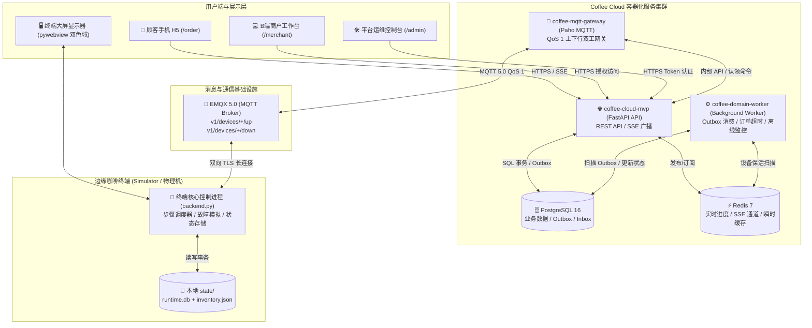
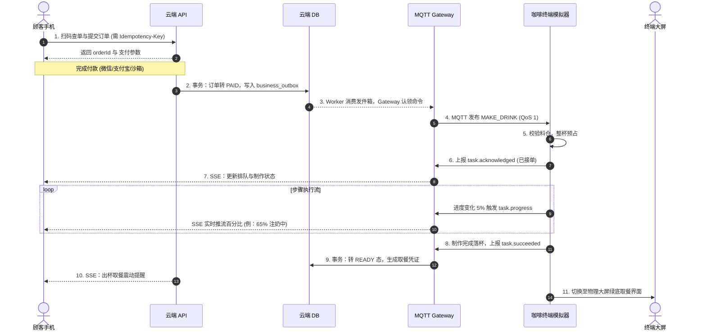
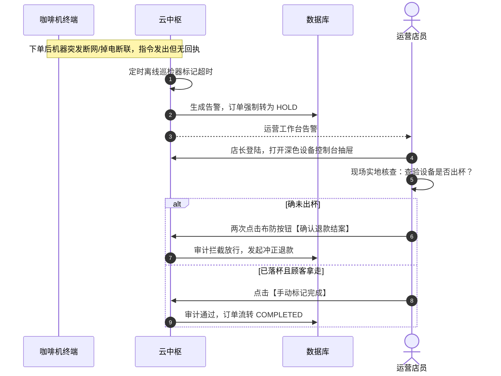

# Coffee Cloud MVP

> English version: [README.md](README.md) · [文档索引](docs/README.md)

面向无人自动贩卖咖啡终端的工业级运营后台与控制中枢。当前版本（`0.4.0-production-grade`）已完整实现订单与支付域、Transactional Outbox、多设备 MQTT 5.0 Gateway 协同、MQTT 凭证生命周期，以及不确定物理结果的安全熔断 `HOLD` 机制。

本仓库包含了云平台的完整实现，配套终端模拟器代码位于 `coffee-terminal-simulator`。系统采用 FastAPI + PostgreSQL 模块化单体架构与独立 Gateway/Worker 进程，目前 A1/A2 版本已部署至 VPS，数据库迁移完成，支持公网支付宝扫码与沙箱联调。

---

## 目录
1. [项目全局概述与设计哲学](#1-项目全局概述与设计哲学)
2. [总体系统架构与拓扑设计](#2-总体系统架构与拓扑设计)
3. [代码结构与模块分层解析](#3-代码结构与模块分层解析)
4. [核心业务状态机与物料机制](#4-核心业务状态机与物料机制)
5. [关键业务流程时序图](#5-关键业务流程时序图)
6. [核心运营闭环与 API 入口](#6-核心运营闭环与-api-入口)
7. [二次开发扩展指南](#7-二次开发扩展指南)
8. [运维部署与生产实战手册](#8-运维部署与生产实战手册)
9. [当前边界与演进路线](#9-当前边界与演进路线)

---

## 1. 项目全局概述与设计哲学

**Coffee Cloud** 与 **Terminal Simulator** 是一套面向 AI 自动贩卖咖啡机器人设计的软硬件一体化管理平台。它的核心是在不可靠的网络和硬件环境下，构建一个具备高度数据一致性和资金安全防线的业务系统。

### 核心设计哲学

1. **拥抱分布式环境的不确定性**：在工控与物联网场景中，网络抖动、进程重启或断电是常态。我们在设计时不假设“命令下发成功等同于机器执行成功”。系统主要依赖 **Transactional Outbox（事务发件箱）** 来保证数据库状态与外部系统消息投递的最终一致性，结合“至少一次投递（At-Least-Once Delivery）”和“业务端严格幂等去重”，确保消息在异常恢复后不丢、不重。
2. **设备事实单向流**：云端不做复杂的物理推断。料仓是否扣减成功，以设备确认预占或扣减上报为准；动作是否执行完毕，以设备的事件流水为准。
3. **资金风控底线（HOLD 状态保护）**：在出现命令已发出但设备失联的场景时，我们无法断定咖啡是否已经物理流出。此时订单会进入 `HOLD`（人工介入态），系统绝不会擅自触发自动退款，必须由店员在后台核对现场实物后进行人工干预结案。只有确定指令仍在系统排队且超时、从未下发给物理机的订单，才会走自动退款链路，从根本上防止“用户端走拿走咖啡又被退了钱”的货损。

---

## 2. 总体系统架构与拓扑设计



### 三大通信通道
1. **控制下行通道（Cloud → Edge）**：Topic `v1/devices/{deviceId}/down`（QoS 1），承载 `MAKE_DRINK`、`CLEAN`、`RESTART_APP`、`RELOAD_CONFIG` 等高危或生产命令。
2. **遥测与事件上行通道（Edge → Cloud）**：Topic `v1/devices/{deviceId}/up`（QoS 1），承载心跳、制作进度（`task.progress`）和硬件事件。
3. **顾客端实时推流通道（Cloud → Mobile）**：HTTP Server-Sent Events (SSE) `/api/v1/public/orders/{orderId}/events`，通过 PG `LISTEN/NOTIFY` 和 Redis 缓存实现毫秒级同步推送。

---

## 3. 代码结构与模块分层解析

项目基于 `Route → Application Service → Repository → PostgreSQL` 分层：路由处理协议，Service 封装业务规则，Repository 集中 SQL。

### 云平台目录架构 (`coffee-cloud-mvp/`)
```
coffee-cloud-mvp/
├── app/
│   ├── main.py                 # FastAPI 入口：路由、异常处理、生命周期钩子
│   ├── settings.py             # 配置：环境变量解析与类型校验
│   ├── database.py             # 数据库引擎：PostgreSQL 连接池与 schema 迁移
│   ├── protocol.py             # 通信契约：MQTT Payload Schema、正则与时区校验
│   ├── order_logic.py          # 纯函数：状态映射、菜单计算、在线判定
│   ├── order_events.py         # SSE 流通道编码与会话分发
│   ├── payment_service.py      # 支付：回调试错幂等、事务发件箱与意图校验
│   ├── payment_providers.py    # 渠道适配抽象层：Mock / 支付宝 / 微信接入点
│   ├── production_state.py     # 生产状态机：指令合法性过滤与流转
│   ├── live_progress.py        # Redis 热点缓存与高频进度聚合同步
│   ├── mqtt_gateway.py         # 独立进程：多设备 MQTT 5.0 收发网关与出入站队列
│   ├── domain_worker.py        # 独立进程：Outbox 异步调度消费与离线检测
│   ├── emqx_provisioner.py     # EMQX 对接：MQTT 凭证动态下发与 ACL 鉴权管理
│   ├── merchant/               # B端领域模型：商户组织、物料、财报、RBAC权限
│   ├── repositories/           # 仓储层：基础 SQL 封装隔离
│   └── services/               # 领域服务层：处理事务并分发指令
├── public/                     # 前端 Vanilla JS 单页应用（采用 OpenDesign 规范）
│   ├── order.html / order.js   # 手机端扫码点单/等位大屏/支付页面
│   ├── merchant.html / .js     # 商户运营工作台（深林控制台与斜纹进度条）
│   └── shared/coffee-ui.css    # 品牌系统组件与令牌体系
├── tests/                      # 契约冒烟测试 (Node) 与 单元测试 (pytest)
├── compose.yaml                # 生产环境 Docker 容器部署编排配置
└── Dockerfile                  # Python 3.12 生产多阶段构建镜像
```

配套模拟器 (`coffee-terminal-simulator/`) 包含基于 `pywebview` 的内置大屏、物料暂扣状态库和可控故障生成模型，提供完整的端到端仿真环境。

---

## 4. 核心业务状态机与物料机制

### 4.1 订单生命周期与风控
```text
CREATED → PENDING_PAYMENT → PAID → QUEUED → DISPATCHED → ACCEPTED → MAKING → READY
   └──────────────→ CANCELLED / EXPIRED / FAILED
                                      FAILED → REFUNDED
   └──────────────→ UNKNOWN → HOLD (需人工结案)
```
- **ACCEPTED**：机器校验配方版本，成功预占整杯物料。
- **MAKING**：设备定时上报进度；云端将进度更新到 Redis 并广播 SSE。
- **HOLD**：出现下发失联断层等情况时，订单锁定，拒绝强行退款，防止货损。客户仅能取消尚未派发的 `QUEUED` 订单，一旦派发后禁止从网页强行取消。

### 4.2 共享物料精密三段式控制
多个配方消耗共享的咖啡豆、牛奶、水和糖浆，为防超卖：
1. **预占（Reserved）**：接单瞬间将整杯用量累加至 `reserved`。若 `onHand - reserved < 0` 则拒绝订单。
2. **扣减（On-Hand Deduction）**：按配方步骤到达对应阶段时才扣除 `onHand` 和 `reserved`。使用 `taskId:stepId:attempt` 保证幂等去重。
3. **释放（Release）**：任务结束或取消时，未执行耗材一并解除预占，防止库存假死。

---

## 5. 关键业务流程时序图

### 5.1 端到端扫码点单、支付与制作协同



### 5.2 硬件异常熔断与 HOLD 人工结案时序



---

## 6. 核心运营闭环与 API 入口

### 现网页面入口
- **手机下单（扫码进入）**：`https://coffee-api.woodbridge.top/order?device_id=coffee-bot-002`
- **订单状态**：自动跳转 `/order/status#order=...&token=...`（基于 fragment，令牌不写日志）。
- **设备运营台**：`https://coffee-api.woodbridge.top/admin`
- **API 文档**：`https://coffee-api.woodbridge.top/docs`
- **就绪探针**：`https://coffee-api.woodbridge.top/ready`（带数据库连通与防抖）

### 核心规范
- **下单幂等约束**：创建订单、发起支付和退款必须请求头携带 `Idempotency-Key`。同键同载荷返回原结果，同键异载荷返回 `409 Conflict`。
- **支付隔离策略**：受 `PUBLIC_PAYMENT_MODE`（TEST_FREE / ONLINE）控制。线上模式下未支付订单无派发权利；支付渠道回调仅确认账务并落入事务信箱，不会因为回调失败而错过发单，确保在进程崩溃场景下恢复执行。
- **动态二维码**：为确保扫码一致性，终端仅显示 HTTPS 动态拉取的设备专属下单地址，不使用写死的固化链接。

### 角色权限 (RBAC)
- `VIEWER`：基础查阅设备、订单总览。
- `OPERATOR`：增加设备登记、生命周期管理与安全远程控制。
- `MANAGER`：增加操作退款、处理 HOLD 单据并拥有权限只读。
- `OWNER`：租户最高权限，可颁发 Token 和修改角色配置。

所有后台调用需传递 `Authorization: Bearer <TOKEN>`，新运营 Token 仅在创建响应中显示一次，部分高危命令（退款、凭证吊销、生命周期）将强制写入 `audit_log` 留痕。

---

## 7. 二次开发扩展指南

### 7.1 新增一款饮品配方与物料定义
扩展饮品**无需重构后端 Python 代码**。只需在模拟器 `config/{deviceId}/recipes/` 新建配置（例 `vanilla_latte.json`），定义各制作 `steps` 时长区间、物料消耗。
通过 `curl -X POST http://127.0.0.1:9101/device/v1/config/reload` 发送热加载，终端随之上报能力快照，云端菜单实时刷新。

### 7.2 扩展全新的硬件控制命令
1. 在 `app/protocol.py` 中的 `CommandCreateRequest` 类中加入枚举（如 `CALIBRATE_SCALE`）。
2. 在前端 `public/merchant.js` 利用 `makeArmedButton` 添加两段式二次防误触布防按钮，调用 `sendDeviceCommandFlow` 派发。
3. 模拟器端在 `backend.py` 注册相应的句柄来执行对应的控制逻辑。

### 7.3 接入第三方全新支付渠道
实现 `app/payment_providers.py` 中的 `PaymentProvider` 抽象类，提供统一下单、验签回调与退款能力，挂载对应 webhook，系统底层的发件箱将自动为你保障单边账幂等容错。

### 7.4 自动化验证标准
代码修改提交前必须执行 100% 冒烟与测试保障：
```bash
# 安装开发环境依赖 (严格锁文件)
uv venv --managed-python --python 3.12 .venv
uv pip install --python .venv/bin/python -r requirements-dev.lock

# 1. 云端 Node 契约测试 (前端、逻辑契约)
node --test tests/*.mjs

# 2. 云端 Python 业务域测试
.venv/bin/pytest -q

# 3. 重新生成 API 契约文档
.venv/bin/python scripts/export_openapi.py
```

---

## 8. 运维部署与生产实战手册

### 8.1 Docker 容器集群编排与配置
项目通过 `compose.yaml` 基于多容器隔离：
- `coffee-cloud-mvp`（主 API 与前端，不消耗高频状态 IO）
- `coffee-mqtt-gateway`（MQTT 收发引擎池，轻量无状态且具备自愈 Supervisor 线程）
- `coffee-domain-worker`（后台事务引擎、掉单与超时审计扫描，单例锁定避免竞态）

```bash
# 备份旧版数据库
docker exec postgres-web pg_dump -U coffee_cloud -Fc coffee_cloud_mvp > coffee-cloud-before-upgrade.dump

# 构建与拉起
docker compose up -d --build
docker compose ps
docker compose logs -f --tail=100 coffee-mqtt-gateway
```
数据表迁移采用专门工具运行，应用 API 将跳过并发修改 schema：
```bash
docker compose --profile tools run --rm coffee-db-migrate
```

### 8.2 核心安全与环境变量设置（`.env`）
重要变量必须从隔离的 `.env` 或 Docker secret 挂载，切勿提交至代码库：
- `DATABASE_URL`：PostgreSQL 连接串。
- `ORDER_ACCESS_SECRET`：订单页敏感鉴权 HMAC 私钥，**生产必须配置且绝对不能与管理员凭证共用**。
- `ALIPAY_GATEWAY` / `ALIPAY_APP_ID` / 密钥文件路径：支付宝网关。
- `MQTT_GATEWAY_ID`：多实例部署下每个网关必须具有独立的 Paho Session ID，否则将引发互踢掉线。
- `TELEMETRY_REDIS_URL`：Redis 长连接服务，负责处理高频心跳更新，不可用时订单数据强制回退至 SQL 降级。
- `EMQX_MANAGEMENT_URL` / `EMQX_DASHBOARD_USERNAME`：用于同步签发每台设备的 MQTT 专属账号与 ACL，生产推荐指向内网本地管理口。

### 8.3 MQTT 网关全生命周期与健康检测
- 网关采用 `clean_start=False` 与长期会话策略（默认 604800s），保证 QoS1 的离线重投堆积能力。
- 每次新连接、重连或者超时（`MQTT_SUBSCRIBE_TIMEOUT_SECONDS`）都会通过安全的重入锁校验代次（Generation）。网络掉线由单独的 `Supervisor` 调度线程拉起；发生致命死锁时，它停止写 `/tmp/mqtt-gateway.json`，Docker 会自动将服务标记为 `unhealthy` 并强制重启。

### 8.4 设备激活与上线
1. 管理员在 `/admin` 登记设备并生成一次性激活码。
2. 现场装配执行以下指令，注入激活文件至隐藏 `secrets/` 目录：
```bash
.venv/bin/python scripts/activate_instance.py coffee-bot-003 \
  --activation-code-file .secrets/coffee-bot-003.activation-code \
  --secrets-file .secrets/coffee-bot-003.env

# 启动实例
./start-instance.command coffee-bot-003 --env-file .secrets/coffee-bot-003.env
```
激活期间，`emqx_provisioner.py` 动态向 EMQX Broker 颁发独立的 MQTTS 接入凭证。从根本上截断设备篡改冒充链路。

---

## 9. 当前边界与演进路线

当前必须严守架构底线：支付前不派发物理指令、单台机器串行制作不并发、设备事件上报使用持久 Inbox 去重、隔离私密证书文件不泄漏。

**近期优化优先级（2026-08-30）**：
1. **现网支付切换**：配置支付宝沙箱密钥并完成真实扫码、回调、主动查询与退款验收，再把现网 `PUBLIC_PAYMENT_MODE` 切到 `ONLINE`。
2. **库存台账补全**：增加云端库存交易明细投影与物料补充工单，而不只是保存机器全量快照。
3. **高频限流防御**：增加公网下单接口速率限制、WAF 规则与防滥用监控。
4. **极致性能压测**：完成单节点百万连接与断网消息积压风暴恢复能力的专项压测验证。
