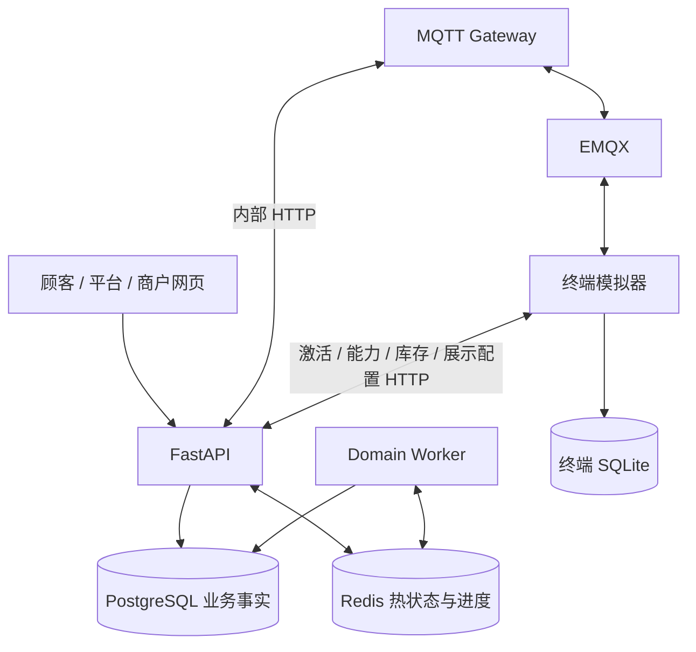

# 应用架构与代码导航

核对日期：2026-09-17。本文描述本地实现；部署状态与容量必须另外验收。

## 进程与数据流

HTTP 兼容模式下，终端直接轮询云端命令并上报数据。MQTT 模式也保留 HTTP 身份、能力/库存与展示配置请求。下行 topic 为 `v1/devices/{deviceId}/down`；上行为 `/up`，心跳也使用该topic中的 `heartbeat` 信封（QoS 0）；另外的 `/state`、`/presence` 使用QoS 1和retain。TLS 使用服务端证书验证和 MQTT 用户凭据，不能表述为已实现设备客户端证书双向 TLS。

## 分层的实际范围

主业务：`app/main.py` 的 Route → `app/services/` → `app/repositories/` → PostgreSQL。Service 通过 `app/db/unit_of_work.py` 管理事务，Repository 接收连接。

商户业务：`app/merchant/router.py` → `MerchantService`、`MerchantAssets`、`MerchantOrders`、`MerchantCosts`、`MerchantAccounts`、`MerchantReports` 等。它们在 `scoped()` 管理的租户/门店事务中执行 SQL。**商户模块尚未拆成同样的 Repository 层**；`tests/test_architecture_layers.py` 检查的范围是主路由与 `app/services/`，不是整个 app。

平台权限定义在 `services/admin_access.py`；商户权限定义在 `merchant/security.py` 与 `merchant/service.py`，角色不能混用。商户事务设置受限数据库角色及作用域，RLS 定义位于 `merchant/rls_schema.py`。

## 核心模块

| 用例 | 代码 |
| --- | --- |
| 下单、报价、取消、队列、匿名旁观 | `services/public_orders.py`、`repositories/orders.py` |
| 派单、生命周期、超时、库存水位 | `services/production.py`、`repositories/dispatch.py`、`production_state.py` |
| HOLD 裁决 | `services/adjudications.py`、`repositories/adjudications.py` |
| 支付、退款和回调 | `services/payments.py`、`services/refund_intents.py`、`payment_transitions.py` |
| 设备身份与软件配对 | `services/device_identity.py`、`services/simulator_pairing.py` |
| HTTP/MQTT 消息进入业务 | `services/device_messages.py`、`services/mqtt_gateway.py` |
| MQTT 网络与发布租约 | `mqtt_gateway.py`、`services/commands.py`、`repositories/mqtt_gateway.py` |
| 遥测与租约 | `telemetry.py`、`telemetry_leases.py`、`repositories/telemetry.py` |
| SSE | `order_events.py`、`order_stream.py`、`live_progress.py` |
| 后台补偿和历史清理 | `services/background_worker.py`、`history_maintenance.py` |
| 进程监督与健康 | `supervised_process.py`、`file_healthcheck.py`、`services/system.py` |

## 事务与外部调用

制作迁移以订单、任务、精确制作命令及相关支付退款记录进行关联检查和锁定。资金操作集中维护退款预算；持久事实提交后才通知浏览器。Pub/Sub、NOTIFY、MQTT PUBACK 都不代表物理动作已经完成。

支付及凭证等外部调用需检查具体服务的边界，遵循本地意图提交 → 外部调用 → 本地结果提交；不能把外部设备或渠道纳入数据库回滚。部分平台操作的审计由路由在业务调用后另行调用，不能笼统承诺所有 API 的业务与审计都原子提交；HOLD 裁决有自己的同事务实现。

## API、Worker 与迁移

`Settings` 的 `RUN_DATABASE_MIGRATIONS`、`RUN_BACKGROUND_WORKERS` 默认 true，`main.lifespan()` 按开关执行。仓库 Compose 对 API 显式设为 false：迁移由 `app.migrate` 一次性完成，后台由 `app.domain_worker` 运行。

Domain Worker 启动离线扫描以及遥测、领域、支付三个循环。领域内部的派单/watchdog/清理共享线程，支付对账与退款共享线程。部署按单实例运行 Domain Worker；入口并没有自动选主来保证只有一个进程。两个 API worker 各有数据库池、SSE 监听器和进程内配额。

## 热数据与可靠消息

- `task.progress` 写 Redis 最新快照并通知，按设备/任务/revision 核验，不写进度历史或高频 SQL。
- 任务/步骤生命周期经持久消息和 PostgreSQL 状态迁移，终态及 HOLD 优先于瞬时进度。
- 设备 heartbeat/presence/state 采用热缓存与批量投影；`telemetry_leases.py` 提供租约处理，旧文档的单纯 ZPOPMIN 描述已经过时。
- PG NOTIFY 与 Redis Pub/Sub 只用于唤醒，重连补读最新快照；排队 SSE 还会周期刷新队列信息。
- MQTT Gateway 按 deviceId 分片上行处理；连接代际防止旧连接回执误用于新连接。
- 终端 MQTT 回调先入队，由运行循环提交 SQLite Inbox 后再 PUBACK；持久化失败断开等待重投，旧连接代际不能确认新连接消息。启动及同步循环恢复 RECEIVED 命令，已开始制作的任务仍须现场核验。

## 新功能落点

新增命令需同时核对云端 `protocol.py`、命令服务/权限、终端 `backend.py._process_commands()` 和结果回传；当前不存在 `COMMAND_HANDLERS` 注册表。新增饮品通常修改终端配方与物料，云端消费能力快照和冻结版本。新增硬件须先引入动作执行接口，不能把当前计时器或 Three.js IK 直接当硬件控制器。

验证与部署见 [operations.md](operations.md)，当前缺口见 [核对记录](documentation-audit-2026-09-17.md)。
