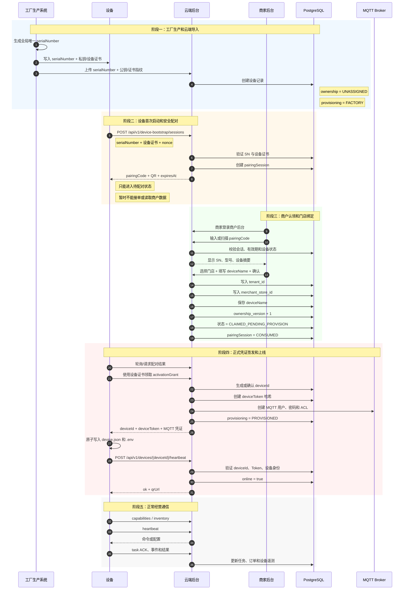
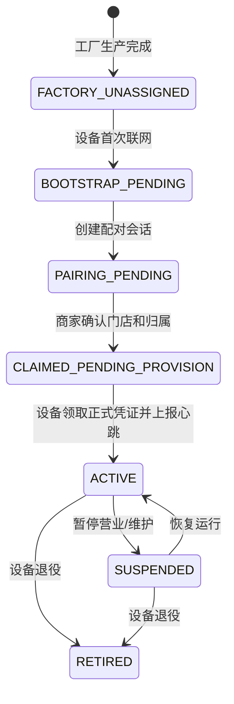
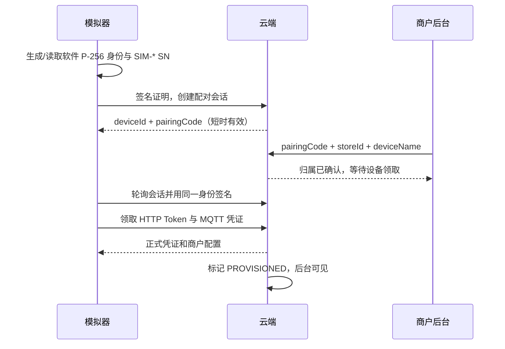

# 设备出厂、注册、激活与商户绑定设计

> 文档目的：统一说明设备从出厂到商户经营上线的身份、凭证、状态和交互流程，避免把 SN、deviceId、设备名称、激活码和认领码混为一谈。
>
> 适用项目：`coffee-cloud-mvp`（云端）与 `coffee-terminal-simulator`（设备端）。
>
> 本文同时记录当前实现和推荐的新流程。推荐流程适用于后续真实设备生产；当前人工激活流程可作为旧设备兼容方案保留。

## 1. 核心结论

设备生命周期应拆成两个独立动作：

1. **设备激活（activation/provisioning）**：证明设备可以安全接入云端，并领取正式的 HTTP/MQTT 通信凭证。
2. **商户绑定/认领（claim/ownership）**：把设备归属到某个商户组织和门店。

设备名称只是显示标签，允许重复，不能作为设备身份。

```text
SN                 = 工厂生产身份，永久不变
deviceId           = 云端协议身份，永久不变
deviceName         = 商户显示名称，可以重复
pairingCode        = 商户认领设备的一次性短期码
deviceToken        = 设备正式 HTTP 登录凭证
MQTT password      = 设备正式 MQTT 登录凭证
tenant_id          = 商户组织归属
merchant_store_id  = 商户门店归属
```

## 2. 当前代码中的实现

当前实现是“后台预登记 + 人工激活码”模式：

```text
后台登记设备
    ↓
生成 activationCode
    ↓
设备首次启动输入 deviceNumber、年份、激活码
    ↓
设备推导 deviceId / serialNumber / storeId
    ↓
POST /api/v1/device-activations
    ↓
后台签发 deviceToken 和 MQTT 凭证
    ↓
设备写入配置并进入 ACTIVE
```

相关代码：

- 设备首次启动判断与窗口：[coffee-terminal/app.py](/Users/alex/Downloads/armaster/coffee-terminal-simulator/coffee-terminal/app.py)
- 首次配置和激活：[coffee-terminal/onboarding.py](/Users/alex/Downloads/armaster/coffee-terminal-simulator/coffee-terminal/onboarding.py)
- 设备端云端请求：[coffee-terminal/cloud.py](/Users/alex/Downloads/armaster/coffee-terminal-simulator/coffee-terminal/cloud.py)
- 设备运行时心跳、命令和事件：[coffee-terminal/backend.py](/Users/alex/Downloads/armaster/coffee-terminal-simulator/coffee-terminal/backend.py)
- 云端设备 API：[app/main.py](/Users/alex/Downloads/armaster/coffee-cloud-mvp/app/main.py)
- 激活和凭证服务：[app/services/device_identity.py](/Users/alex/Downloads/armaster/coffee-cloud-mvp/app/services/device_identity.py)
- 平台设备登记：[app/services/admin_operations.py](/Users/alex/Downloads/armaster/coffee-cloud-mvp/app/services/admin_operations.py)
- 设备消息处理：[app/services/device_messages.py](/Users/alex/Downloads/armaster/coffee-cloud-mvp/app/services/device_messages.py)

当前激活过程中的关键行为：

- 后台登记设备后，状态为 `PENDING_ACTIVATION`；
- 后台生成的 `activationCode` 只显示一次，数据库保存哈希；
- 设备端本地生成 `deviceToken`，并在激活时提交给后台；
- 后台核对 `deviceId`、`serialNumber` 和激活码；
- 激活成功后，后台将设备生命周期改为 `ACTIVE`；
- 后台同时签发 MQTT 用户名和密码；
- 设备先写入临时密钥文件，成功后再原子提升为正式 `.env` 文件。

## 3. 推荐的新生产和配对流程

新设备不应要求管理员人工生成激活码，也不应让商家输入设备 Token。建议采用：

```text
工厂写入 SN + 设备私钥/证书
    ↓
云端导入 SN + 公钥/证书指纹
    ↓
设备首次启动，使用设备证书请求配对会话
    ↓
设备显示短期 pairingCode 或二维码
    ↓
商家登录商户后台，输入/扫描 pairingCode
    ↓
商家选择门店并填写 deviceName
    ↓
云端完成商户绑定
    ↓
设备使用设备证书领取最终 deviceId、deviceToken、MQTT 凭证
    ↓
设备写入正式配置并上线
```

### 3.1 完整时序图



### 3.2 为什么不能只使用 SN？

SN 通常会印在设备铭牌、包装和物流单上，因此属于**可见标识**，不是秘密凭证。

如果后台仅凭 SN 发放正式 Token，攻击者只要知道一个 SN，就可能冒充设备。因此首次接入至少需要以下一种证明：

- 设备证书和私钥（推荐，最好由安全芯片保护）；
- 工厂写入的高强度 bootstrap secret；
- 设备制造时生成的密钥对，云端保存公钥，设备只证明自己持有私钥。

SN 的职责是“查找设备”，设备证书/私钥的职责是“证明设备确实是这台设备”。

## 4. 各个 ID、编码和凭证的解释

| 字段 | 示例 | 生成方 | 是否公开 | 作用 |
|---|---|---|---|---|
| `serialNumber` / SN | `CB01-26-000123-7` | 工厂 | 可以公开 | 硬件出厂身份，永久不变 |
| `deviceNumber` | `003` | 旧版首次启动界面 | 可以公开 | 旧流程的输入值，不应作为全局身份 |
| `deviceId` | `dev_01K7M6Y8Q2J4` | 云端 | 可展示 | 云端协议身份、API 路径和设备通信主键 |
| `deviceName` | `1号咖啡机` | 商户 | 可以公开 | 显示名称，允许多个商户重名 |
| `instanceId` | `instance-coffee-bot-003` | 设备端/安装实例 | 可展示 | 本地运行实例标识，不参与认证 |
| `tenant_id` | UUID | 云端 | 一般不展示 | 商户组织归属 |
| `merchant_store_id` | UUID | 云端 | 一般不展示 | 商户门店归属 |
| `ownership_version` | `2` | 云端 | 可展示 | 设备归属版本，防止并发绑定/转移覆盖 |
| `terminal.id` | 数据库内部 ID | PostgreSQL | 不应公开 | 云端内部关联键，不能当作 `deviceId` |
| `activationCode` | 一次性随机字符串 | 平台旧流程 | 仅一次显示 | 旧版首次激活设备 |
| `pairingCode` | `7K4M-92QP` | 云端 | 短期公开 | 商家认领设备的一次性配对码 |
| `pairingSessionId` | UUID | 云端 | 不建议展示 | 一次配对会话的数据库记录 ID |
| `activationGrant` | 随机长字符串 | 云端 | 不展示 | 设备领取正式凭证的短期内部授权 |
| `deviceToken` | 随机长字符串 | 设备端生成或云端签发 | 秘密 | HTTP Bearer Token |
| `credentialId` | UUID | 云端 | 可返回元数据 | HTTP 凭证记录 ID，不是 Token |
| MQTT username | 通常等于 `deviceId` | 云端 | 可展示 | MQTT 登录用户名 |
| MQTT password | 随机字符串 | 云端 | 秘密 | MQTT 登录密码 |
| `bootId` | UUID | 设备每次启动 | 可上报 | 一次进程启动周期的 ID，重启会变 |
| `sequence` | `1, 2, 3...` | 设备运行时 | 可上报 | 同一 `bootId` 内的消息顺序 |
| `messageId` | `hb-...` 或命令 ID | 设备/云端 | 可上报 | 心跳或命令消息去重和确认 |
| `eventId` | UUID | 设备 | 可上报 | 事件去重 ID |
| `taskId` | UUID/任务号 | 云端 | 可展示 | 一次制作任务的唯一 ID |
| `orderId` | UUID/订单号 | 云端 | 可展示 | 用户订单身份 |
| `recipeId` | 配方 ID | 云端 | 可展示 | 制作哪一个饮品 |
| `recipeVersion` | 版本号 | 云端 | 可展示 | 配方版本 |
| `command cursor` | 数字字符串 | 设备端 | 不重要 | HTTP 命令轮询位置，不是设备身份 |

### 4.1 SN 建议格式

SN 不要包含商户名、门店名或设备名称，因为设备可能转售、调店或转移。

推荐格式：

```text
CB01-26-000123-7
```

```text
CB01     产品/工厂代码
26       生产年份
000123   工厂流水号
7        校验位
```

如果存在多个生产基地，可以使用：

```text
CB-SZ-26-000123-7
CB-TPE-26-000123-8
```

SN 必须全局唯一、永久不变、可人工读取，并支持校验位。SN 本身不能替代认证密钥。

### 4.2 deviceId 建议格式

不建议继续使用商家输入的 `001`、`002`、`003` 作为全局设备身份。建议由云端生成一次性永久 ID：

```text
dev_01K7M6Y8Q2J4
```

或者保留可读形式，但后缀应来自云端随机 ID：

```text
coffee-bot-7F3K9A
```

无论采用哪种格式，`deviceId` 都不应依赖商户编号或 `deviceName`。

## 5. 配对码设计

### 5.1 pairingCode

用于商户认领设备，建议：

- 8～12 位；
- 使用 Crockford Base32；
- 排除 `I/O/0/1` 等易混淆字符；
- 有效期 10～30 分钟；
- 一个设备同时只能有一个有效配对会话；
- 数据库只保存哈希；
- 限制错误尝试次数和请求频率；
- 绑定 `serialNumber`、`pairingSessionId` 和设备证书；
- 成功绑定后立即消费，不可重复使用。

二维码可以只携带短期会话地址：

```text
https://coffee.example.com/pair?t=短期随机会话
```

二维码中不能放置永久 `deviceToken` 或 MQTT 密码。

### 5.2 activationGrant

设备正式领取凭证时，不需要人工看到激活码。云端向已完成商户绑定的设备签发短期 `activationGrant`：

- 只绑定一台设备；
- 只绑定一个配对会话；
- 有效期约 5 分钟；
- 只能兑换一次；
- 不展示给商户；
- 必须通过设备证书或 bootstrap secret 兑换。

## 6. 推荐状态机



推荐把状态拆为三个维度，避免单个状态值承载过多语义：

```text
lifecycleStatus  = ACTIVE / SUSPENDED / RETIRED
ownershipStatus  = UNASSIGNED / CLAIMED / TRANSFERRING
provisionStatus  = FACTORY / BOOTSTRAP / PROVISIONED
```

当前代码的 `PENDING_ACTIVATION` 可以暂时兼容表示“尚未完成配对/激活”，但长期建议拆分上述状态。

## 7. 商户端实际体验

商户不应该看到或填写：

```text
deviceToken
MQTT password
terminal.id
```

商户只需要：

1. 登录商户后台；
2. 扫描设备二维码或输入 `pairingCode`；
3. 核对设备 SN 和型号；
4. 选择自己的门店；
5. 填写设备名称；
6. 点击确认绑定。

设备名称允许重名。后台列表应使用以下组合帮助人工识别：

```text
设备名称 + deviceId 后六位 + SN 后六位 + 所属门店
```

## 8. 与当前实现的迁移建议

### 第一阶段：保留旧流程

- 继续支持现有 `POST /api/v1/device-activations`；
- 既有设备继续使用 `activationCode`；
- 不改变已有 `deviceId` 和 `serialNumber`；
- 允许后台管理员手工维护旧设备。

### 第二阶段：新增自动配对流程

增加以下能力：

```http
POST /api/v1/factory/devices
POST /api/v1/device-bootstrap/sessions
GET  /api/v1/device-bootstrap/sessions/{sessionId}
POST /merchant/devices/pair
POST /api/v1/device-bootstrap/complete
```

同时调整：

- 设备首次启动改为读取内置 SN，不再要求商家输入 `deviceNumber`；
- `deviceId` 改由云端生成或在工厂导入时分配；
- 商户绑定使用 `pairingCode`，不使用人工激活码；
- 设备使用证书/私钥领取最终 Token；
- `deviceName` 仅作为展示字段，不设置全局唯一约束；
- 平台侧补齐认领码/配对会话的签发接口；
- 对 `tenant_id`、`merchant_store_id` 和设备凭证分别审计。

当前商户模块已经存在认领逻辑（`/merchant/devices/claim`），但平台侧签发认领码的公开路由目前不完整。新设计可以直接将它升级为基于 `pairingSession` 的配对接口。

## 9. 最终记忆方式

```text
SN
  说明：工厂生产的哪台机器

设备证书/私钥
  说明：这台机器能否证明自己是真的

deviceId
  说明：云端把这台机器识别成谁

pairingCode
  说明：商家要认领哪台机器

tenant_id / merchant_store_id
  说明：这台机器属于谁、放在哪个门店

deviceName
  说明：页面上怎么称呼它，可以重名

deviceToken / MQTT password
  说明：设备如何安全登录和通信
```

## 10. 当前模拟器实现（开发环境）

已实现一条不依赖人工激活码的模拟器流程；旧的激活接口仍保留给存量设备。



云端默认关闭该开发入口。仅本地或专用演示环境设置
`SIMULATOR_BOOTSTRAP_ENABLED=true` 后，模拟器首次启动页才可创建会话。
管理员设备详情和商户设备详情都会显示接入状态：`PAIRING_PENDING`、
`CLAIMED_PENDING_PROVISION` 或 `PROVISIONED`。模拟器私钥仅保存在本机
`.identity/`，用于验证流程，不能替代量产硬件的安全芯片。
