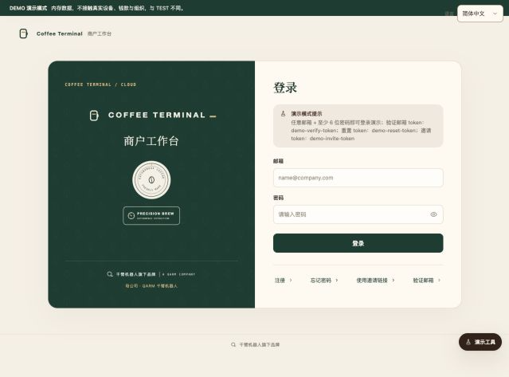
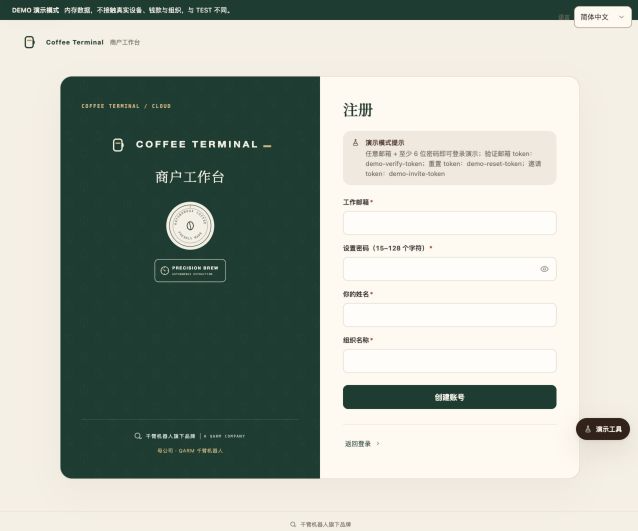
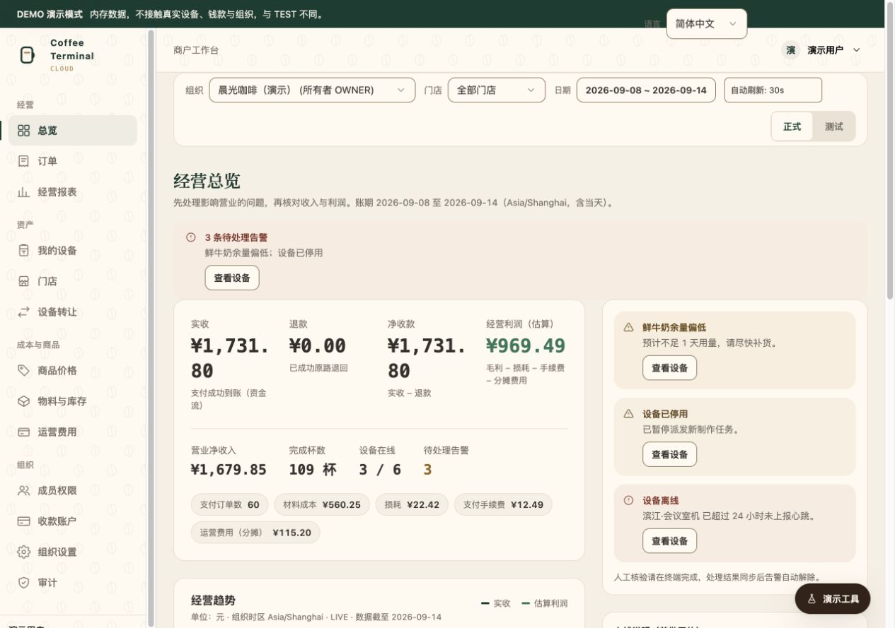
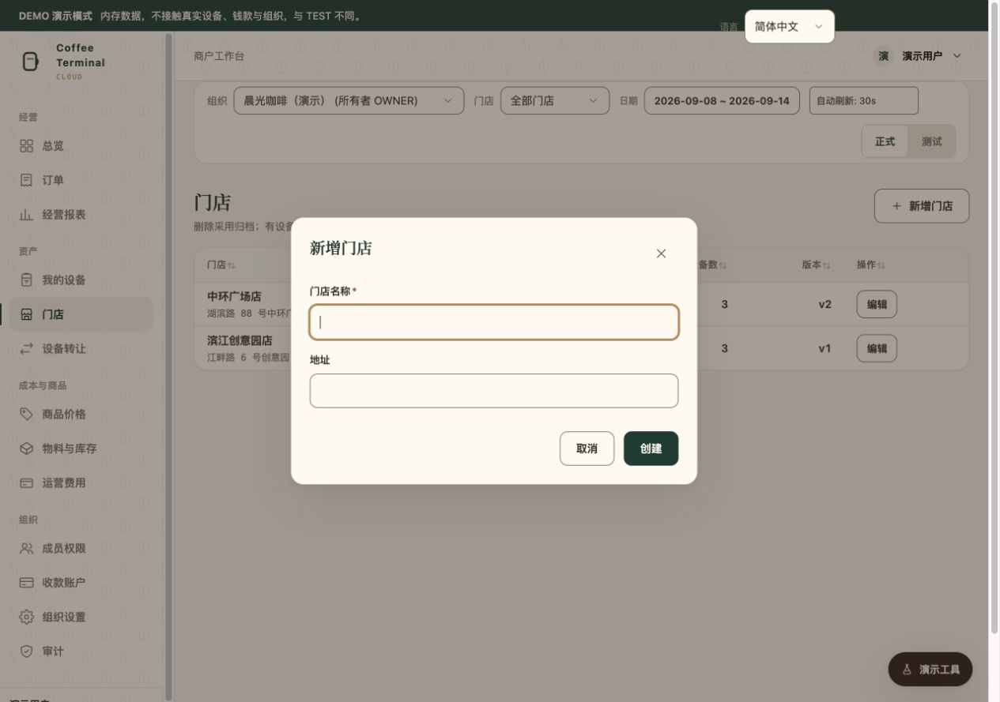
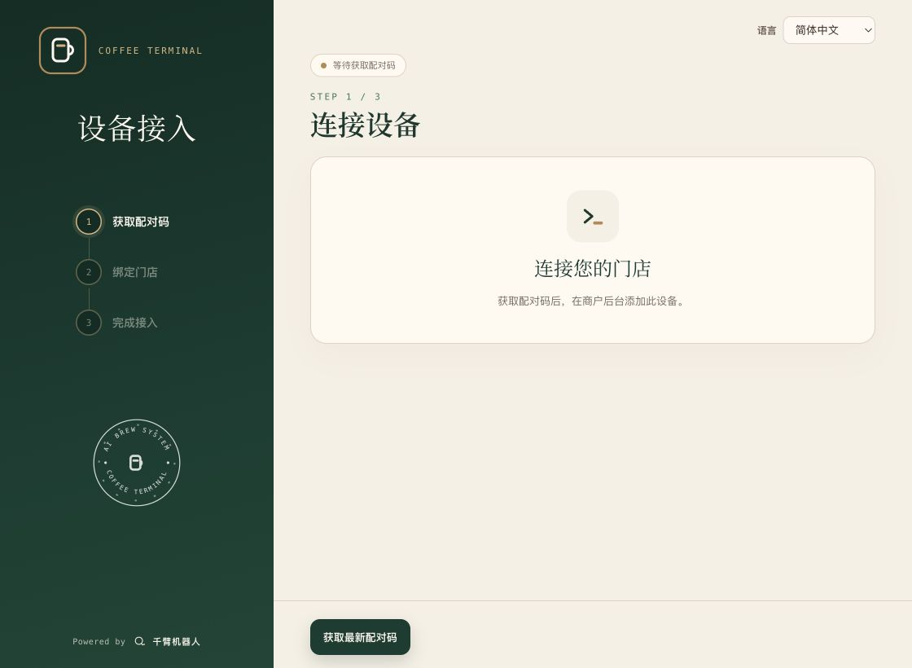
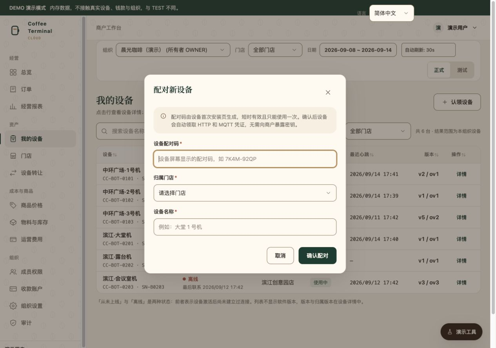
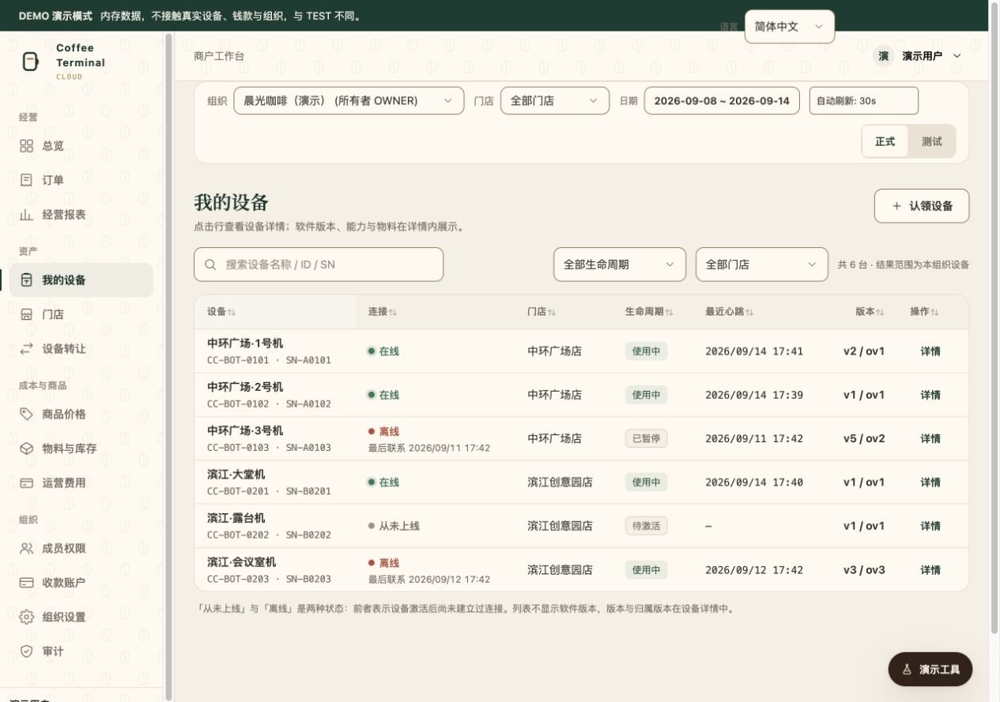
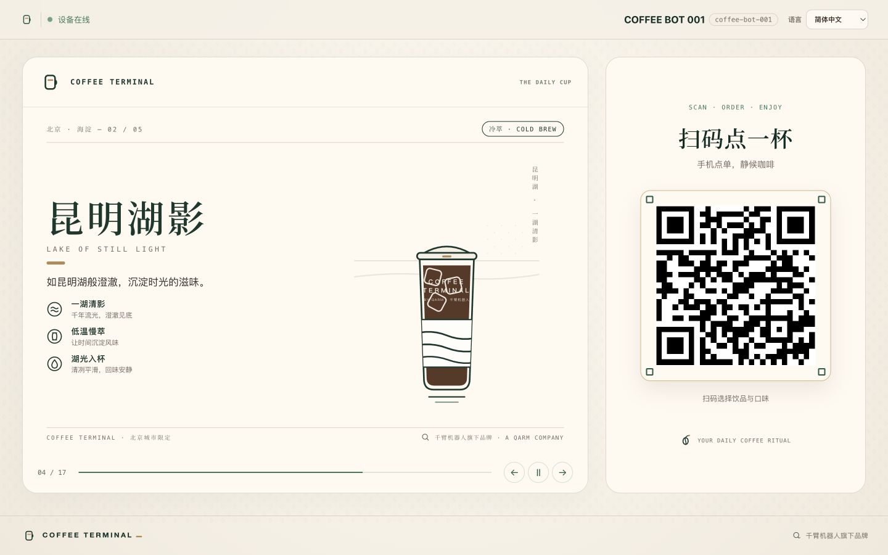
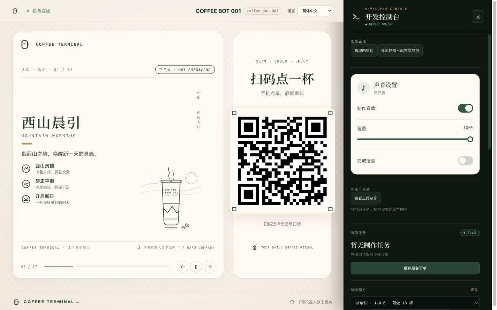

# Coffee Terminal 商户图解使用手册

面向门店负责人、店长和获授权的运营人员。更新：2026-09-16。

**首次使用：注册登录 → 创建门店 → 启动模拟器 → 获取配对码 → 后台确认配对 → 重启并检查在线状态。**

## 快速定位

| 我要做什么 | 阅读位置 |
| --- | --- |
| 注册并进入后台 | [1. 注册与登录](#1-注册与登录) |
| 创建设备所属门店 | [2. 创建门店](#2-创建门店) |
| 首次启动模拟器 | [3. 获取配对码](#3-启动模拟器获取配对码) |
| 将设备绑定到门店 | [4. 确认配对](#4-在后台确认配对) |
| 确认接入成功 | [5. 重启与上线检查](#5-重启与上线检查) |
| 打开模拟器调试页面 | [6. 调试控制台](#6-进入模拟器调试控制台) |
| 日常操作与故障处理 | [7. 日常操作](#7-日常操作)、[8. 常见问题](#8-常见问题) |

## 1. 注册与登录

打开 [Coffee Terminal 商户后台](https://coffee-api.woodbridge.top/assets/merchant.html)，建议使用 Edge 或 Chrome。



**已有账号：**填写自己的用户名或邮箱及密码，点击 **登录**。以页面显示的账号类型为准。

**首次注册：**点击 **注册**，填写表单后点击 **创建账号**。



| 字段 | 如何填写 |
| --- | --- |
| 用户名／工作邮箱 | 日后登录使用。图2展示邮箱模式；若页面显示用户名，请按页面规则填写用户名。 |
| 你的姓名 | 门店负责人或账号使用人的姓名。 |
| 组织名称 | 商户或公司名称，例如“晨光咖啡”；具体分店在下一步建立。 |
| 设置密码 | 按当前页面显示的长度要求设置。 |

**完成标志：**页面提示注册成功。用户名模式可直接登录；邮箱模式如提示验证邮箱，先完成邮件验证。没有注册入口时，联系平台管理员获取账号或邀请。

> 图中的“任意邮箱登录”仅适用于DEMO。正式后台必须使用自己的有效账号。已有组织的员工应接受邀请加入，避免重复创建组织。

登录后先核对顶部 **组织**，再选择要查看的 **门店**。



## 2. 创建门店

已有目标门店可跳过本节。

1. 点击左侧 **门店**，再点击 **新增门店**。
2. 填写门店名称和地址。
3. 点击 **创建**。



**完成标志：**门店出现在列表中。若没有新增入口，检查当前组织及账号权限。

## 3. 启动模拟器，获取配对码

### 启动前准备

Windows电脑需安装 WebView2 Runtime、连接网络，并使用同一Windows用户启动软件。将平台提供的完整发布包解压，保留整个目录，不要只复制单个EXE。

Windows 版模拟器下载：
[下载 CoffeeTerminal 完整发布包（需要微信登录）](https://share.weiyun.com/ndz3ufUb)。
[下载 CoffeeTerminal 公网发布版本（直接下载）](https://pub-db370538412943d0a7f6478d1c92c048.r2.dev/CoffeeTerminal_20260915_215839.zip)
双击 **CoffeeTerminal.exe**，常见位置为：

```text
CoffeeTerminal\CoffeeTerminal.exe
```

### 首次接入

启动时先显示品牌启动页，随后进入 **设备接入** 页面。



1. 点击 **获取最新配对码**。初次打开页面不会自动生成配对码。
2. 等待显示配对码及有效期。
3. 保持窗口打开，转到商户后台完成下一节。

**完成标志：**显示有效配对码，并提示等待商户确认。

配对码过期时，点击 **重新生成配对码**，只使用最新一组。图5不包含有效配对码，请以本机生成的码为准。直接在浏览器打开HTML不能完成配对，应从EXE启动。

## 4. 在后台确认配对

1. 点击左侧 **我的设备**。
2. 点击右上方 **认领设备**，打开标题为 **配对新设备** 的弹窗；部分版本按钮直接叫“配对新设备”。
3. 输入模拟器刚生成的配对码。
4. 选择归属门店，填写设备名称，例如“中环店·大堂1号机”。
5. 核对后点击 **确认配对**。



**完成标志：**后台提示已配对，等待设备完成接入。不要重复提交，也不要关闭仍在接入中的模拟器。

> 配对码不是登录密码、平台管理员Token或旧版激活码。找不到目标门店时，先取消弹窗，核对组织并创建门店。

## 5. 重启与上线检查

回到模拟器，等待自动接入。长时间停留在等待状态时，可点击 **刷新配对状态**。

看到 **设备已完成配对** 或 **自动接入完成** 提示后：

1. 关闭首次安装窗口。
2. 再次启动同一份 **CoffeeTerminal.exe**。
3. 等待主界面显示 **设备在线**，并出现本机下单二维码。
4. 回后台 **我的设备**，核对设备名称、门店、连接状态及最近心跳。



**接入完成：门店归属正确、设备在线、模拟器主界面正常。** 刚完成配对时允许等待一轮自动刷新，仍未更新可刷新后台页面。**正常联网后可以直接手机扫描下单**；



图8为预览环境。营业或演示时请扫描本机EXE生成的二维码，不要扫描本手册中的码。

## 6. 进入模拟器调试控制台

调试控制台位于 **模拟器内部**，不是商户后台的管理页面。

### 打开与关闭

先点击模拟器窗口，让键盘焦点回到软件，再任选一种方式：

| 方式 | 操作 |
| --- | --- |
| Windows／Linux | 按 **Ctrl + K**。 |
| macOS | 按 **⌘ + K**。 |
| 鼠标／触屏 | 连续点击左上角 **品牌图标／设备在线区域5次**，点击之间不要停顿超过约2.5秒。 |
| 关闭 | 点击控制台右上角 **×**，或再次按快捷键。 |

**完成标志：**右侧出现 **开发控制台**。请使用上述入口，不依赖“双击”操作。



### 常用功能

请在右侧面板内部向下滚动，查看配方、库存和事件日志。

| 区域／按钮 | 用途与要点 |
| --- | --- |
| 品牌轮播 → 管理内容包 | 导入交付ZIP，先预览再启用；制作期间更新会暂缓。详见[内容包规范](../../coffee-terminal-simulator/docs/showcase-partner-interface-v1.md)。 |
| 声音设置 | 开关制作音效、调节音量、设置完成语音，按门店环境调整。 |
| 三维工作站 → 查看三维制作 | 查看当前场景和镜头，不会发起新订单。 |
| 当前任务 → 模拟后台下单 | 供授权人员验证；会产生调试任务，影响设备忙闲和库存。 |
| 制作配方 → 同步菜单到后台 | 同步已保存的菜单，等待成功提示；失败时记录错误。配方修改由受训人员操作。 |
| 物料库存 → 补满 | 完成实际补料后再更新数量。 |
| 事件日志 | 查看运行事件；报障时记录时间、步骤和原因。 |
| 故障注入／任务操作 | “下一步失败”“模拟断网”“跳过”等会改变运行过程，营业期间不要试按。 |

## 7. 日常操作

### 开店前

- 启动模拟器，确认 **设备在线**。
- 后台查看 **总览** 中的告警，再到 **我的设备 → 详情** 核对状态。
- 核对门店、菜单和现场原料，补料后更新库存。
- 完成经授权的演示验证，检查制作、完成提示和取杯流程。

### 制作完成后

移走杯子，并在软件模拟环境点击 **确认杯子已取走（模拟传感器）**。

只关闭三维视图或让手机返回点单页，不等于确认取杯。取杯位未释放时，设备可能保持READY，暂不能开始下一单。

### 重启后提示待人工处理

制作途中直接关闭软件，重启后可能需要人工核验。

1. 在终端点击 **工作人员 · 人工核验**。
2. 查看中断步骤与原因，完成杯子移除、工作区清理等现场检查。
3. 逐项确认后再提交。当前流程会取消中断任务并返回待机，不会继续原步骤。
4. 回后台确认告警解除；有关联订单时另行核对订单及退款状态。

不能确认现场安全时联系技术人员。详细流程见[重启中断与人工核验](../../coffee-terminal-simulator/docs/restart-recovery.md)。

## 8. 常见问题

| 现象 | 下一步 |
| --- | --- |
| 没有注册入口 | 联系平台管理员获取账号或邀请。 |
| 忘记密码 | 邮箱账号按“忘记密码”处理；用户名模式如提示联系管理员，则由管理员重置。 |
| 没有认领设备／新增门店按钮 | 核对当前组织，联系组织所有者确认配对或门店管理权限。 |
| 配对码无效、已用或过期 | 回模拟器生成新码，只提交最新一组。 |
| 获取配对码失败 | 确认从EXE启动、网络正常，按页面错误处理后重试。 |
| 后台已确认，模拟器仍等待 | 保持同一个设备窗口打开，点击“刷新配对状态”，检查网络。 |
| 配对成功但仍停在安装页 | 看到完成提示后关闭窗口，再启动EXE。 |
| 离线／从未上线 | 检查程序、网络和电脑休眠，恢复后等心跳更新；通常无需重新配对。 |
| 制作完成仍是READY | 在模拟器确认已取杯，释放取杯位。 |
| 重启后待人工处理 | 按第7节完成现场核验，勿删除数据或反复重启绕过。 |
| Ctrl + K无反应 | 先点击模拟器窗口；也可连续点击左上角品牌区域5次。 |
| 启动提示端口占用 | 检查是否重复启动同一设备，正常关闭旧窗口后重试；仍失败时记录端口和报错。 |
| 更换Windows用户／电脑后不能运行 | 不复制原凭证文件，联系平台管理员迁移或重新配对。 |

## 9. 报障与资料保管

提供 **门店名称、设备名称／ID、发生时间、操作步骤、错误文字及必要截图**。截图隐藏顾客信息和有效配对码。

商户不需要索取或传递设备Token、MQTT密码、私钥及平台管理员Token。不要自行删除设备数据；公用电脑使用完毕后退出商户后台。

---

**图片维护：**9张PNG位于 `docs/images/merchant-guide/`，分享Markdown时请一并提供该目录。截图取自2026-09-14本地版本，不代表生产服务已更新或真实设备已完成配对。入口与流程变更时，应同步更新文字和图片。
