# 咖啡机物联网系统：软件架构与业务流程说明

> 代码核对日期：2026-08-30。后端基线：`eeabd4e`；模拟器基线：`d859df8`。本文描述已实现的软件，不把规划功能当作现有能力。部署数据为本次只读检查快照。

## 阅读导航

- 想先理解全貌：读第 1–3 节。
- 想理解下单到制作：读第 4–6 节。
- 想理解 Redis、PostgreSQL 与 SSE：读第 7–8 节。
- 想理解状态与可靠性：读第 9–12 节。
- 想评估运维和扩容：读第 13–15 节。

本目录 `README.md` 是带已渲染图片的阅读版；`README.source.md` 是包含 Mermaid 源码的可编辑版。两者内容一致，图表可单独打开 SVG 放大。

## 1. 一句话理解系统

这是一个“云端管理交易与派单、终端自主执行制作”的物联网系统。云端不通过网络逐步控制每个电机动作，也不虚构制作进度；模拟器根据配方执行步骤，并将实际状态反馈给云端。

当前终端是 **Python + pywebview 的设备模拟器**，不是已实现的 MCU 固件或真实硬件驱动。将来接入嵌入式设备，需实现同样的设备协议和本地安全/执行逻辑。

### 图 1：系统全景框架

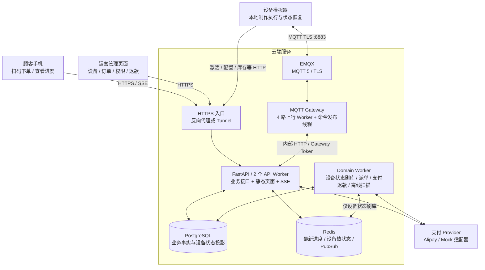

职责不能混淆：EMQX 负责消息传输；Gateway 负责 MQTT/HTTP 适配；API 与 Service 执行业务规则；Domain Worker 处理异步业务；终端决定实际制作结果。

## 2. 后端代码分层与模块结构

技术栈来自 [requirements.txt](../../requirements.txt)：FastAPI、Uvicorn、psycopg 连接池、Redis 客户端、Paho MQTT、HTTPX。顾客与管理页面在 `public/`，使用原生 HTML/CSS/JavaScript，并非 React/Next.js。

### 图 2：代码依赖与事务边界

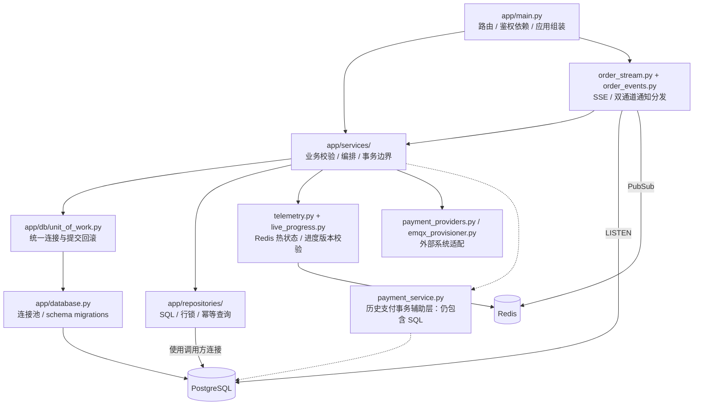

设计目标是 Route → Service → Repository；但当前存在 `payment_service.py` 直接操作 SQL、抛 HTTPException 的历史例外，不能把“严格分层”描述为全部完成。

| 主要文件/目录 | 责任 | 阅读重点 |
| --- | --- | --- |
| [app/main.py](../../app/main.py) | 路由、依赖注入、启动关闭、Worker 循环定义 | API 入口以及运行模式 |
| [services/public_orders.py](../../app/services/public_orders.py) | 菜单、订单创建、访问令牌、订单快照 | 下单幂等和读模型 |
| [services/payments.py](../../app/services/payments.py) | 支付创建、回调、退款接口 | 外部调用与事务分离 |
| [services/production.py](../../app/services/production.py) | 派单、任务 ACK、制作事件、退款意图 | 订单与设备执行的桥梁 |
| [services/device_identity.py](../../app/services/device_identity.py) | 激活、设备身份、凭证与 MQTT 账号 | 设备不是匿名接入 |
| [services/mqtt_gateway.py](../../app/services/mqtt_gateway.py) | 上行消息分类、校验与 Inbox | 进度走 Redis，事实走 SQL |
| [mqtt_gateway.py](../../app/mqtt_gateway.py) | 独立 MQTT 进程 | 分片队列、微批、发布租约 |
| [domain_worker.py](../../app/domain_worker.py) | 独立后台进程入口 | 不随 API Worker 数量复制 |
| [services/background_worker.py](../../app/services/background_worker.py) | Outbox、派单、支付核验、退款、watchdog | 后台业务职责 |
| [order_events.py](../../app/order_events.py) / [order_stream.py](../../app/order_stream.py) | 通知订阅与 SSE 生成器 | 两种通知触发不同读取路径 |
| [telemetry.py](../../app/telemetry.py) / [live_progress.py](../../app/live_progress.py) | 热数据、Lua、版本过滤、进度合并 | 不让实时进度重新进入 SQL |
| [repositories/](../../app/repositories/) | SQL 持久化 | 唯一约束、行锁、批量写入 |
| [public/](../../public/) | 顾客和管理端静态前端 | SSE 是服务器到浏览器，不是设备协议 |

## 3. 设备模拟器的本地架构

### 图 3：模拟器模块框图

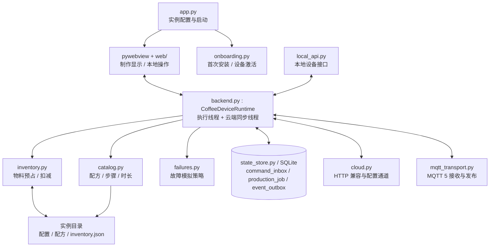

每个模拟器实例有独立的 deviceId、配置目录和 SQLite 状态库；同机多实例还需使用不同本地 API 端口。多台设备可以并行，单台默认只执行一个活动制作任务。

- 制作循环约 250ms 推进一步，不等于每 250ms 发网络消息。
- 整杯进度变化达到 5 个百分点，**或**距上次上报达到 5 秒，就上报 `task.progress`；短配方可能比每 5 秒更频繁，不能把 5 秒当作最小间隔。
- MQTT 模式：云端通过订阅下行 Topic 派单，设备不轮询订单；HTTP 兼容模式仍保留命令轮询。
- 能力/库存每约 2 秒检查本地版本，仅版本变化才 HTTP 同步；展示配置仍约每 30 秒 HTTP 获取。
- 重启恢复活动任务时先进入本地 `PAUSED/RECOVERING`，不盲目再制作一杯。
- SQLite 保存任务、命令和待发事件；库存部分同时使用 JSON 文件，不能据此宣称物料与任务跨文件事务完全原子。

代码入口：[app.py](../../../coffee-terminal-simulator/coffee-terminal/app.py)、[backend.py](../../../coffee-terminal-simulator/coffee-terminal/backend.py)、[state_store.py](../../../coffee-terminal-simulator/coffee-terminal/state_store.py)。

## 4. 主业务逻辑：下单到出杯

### 图 4：业务逻辑图

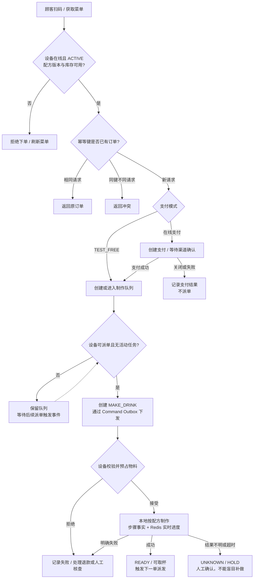

关键决策：支付成功不等于已经制作；Broker 收到命令不等于设备已接受；进度 100% 也不能替代 `task.succeeded` 业务事实。

派单检查的是云端在线时间、激活状态、活动任务与队列；设备收到任务后还会再次校验配方和本地物料。云端菜单库存是快照，不是物理扣料的最终事实。

## 5. 下单与支付时序

### 图 5：在线支付订单时序

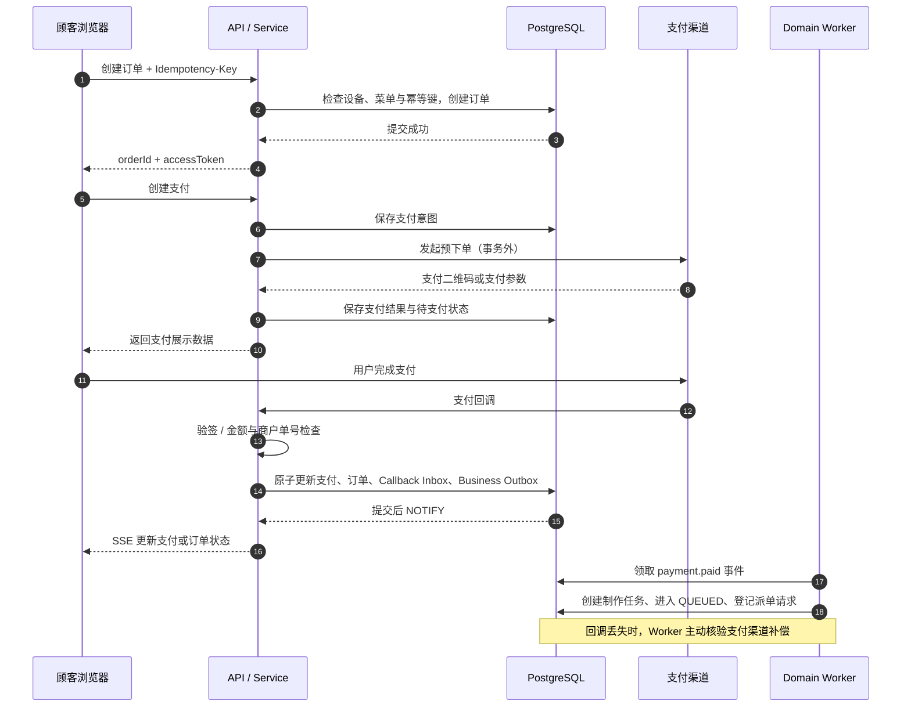

`TEST_FREE` 不经过外部支付：订单创建事务直接创建制作任务，并登记派单请求。支付关闭与订单关闭并不是同一个状态字段，应分别阅读 `sales_order.status` 和 `payment.status/payment_status`。

## 6. MQTT 派单与确认时序

### 图 6：命令传输与业务 ACK

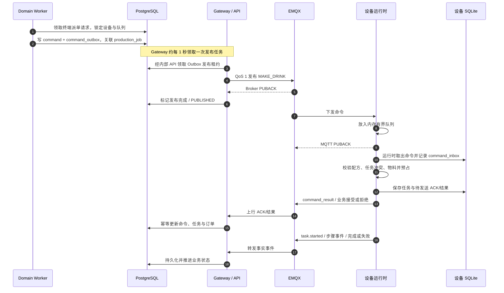

这里有三种不同的确认：

| 确认 | 含义 | 不代表什么 |
| --- | --- | --- |
| Broker 对 Gateway 的 PUBACK | Broker 接受了发布 | 不代表设备收到或执行 |
| 设备 MQTT PUBACK | 消息进入设备内存队列 | 当前实现不等于 SQLite 已落盘 |
| 设备业务 ACK / command_result | 设备接受或拒绝业务任务 | 接受不等于制作成功 |

当前设备在内存入队后即确认 MQTT，SQLite 写入发生在后续执行线程，因此仍有“MQTT 已确认、进程在落盘前崩溃”的窗口。Inbox 幂等有帮助，但不能把当前实现称为端到端 exactly-once。

Gateway 按 deviceId 分片，上行正常路径中同设备进入同一队列；重试会重新排队，不能承诺所有异常情况下都严格有序，仍需 revision 与幂等保护。

## 7. Redis + PostgreSQL 双通道 SSE

### 图 7：实时进度和业务事实时序

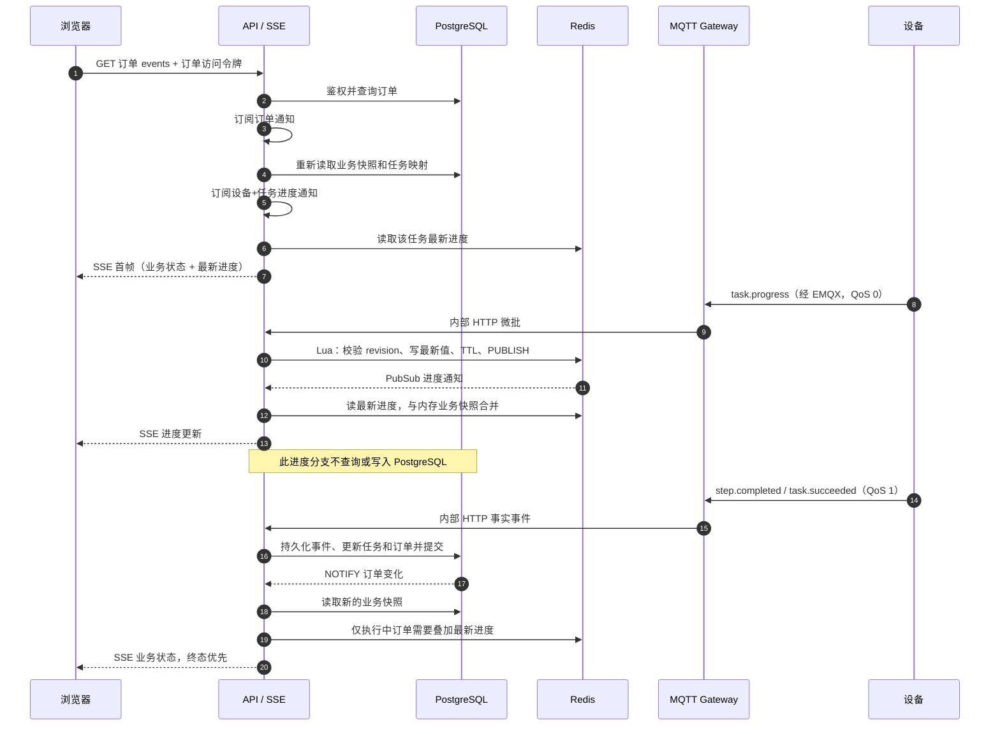

每个 API 进程各有一个 PostgreSQL LISTEN 连接、一个 Redis Pub/Sub 连接；不是每个浏览器占用一个数据库监听连接。每个 SSE 订阅只保留容量 1 的合并通知队列，SQL 刷新标记不会被大量进度通知覆盖。

进度键按 **设备 + 任务** 隔离，TTL 为 1 小时，Lua 仅接受更高 taskRevision。只有订单 `MAKING` 且任务 `EXECUTING` 时才能叠加进度；终态与云端 HOLD 不被进度改写。数据库进度字段现在表示最近步骤/生命周期检查点，不再表示最高频进度。

首次连接与重连都补读快照。PG/Redis 监听断线恢复后也唤醒已有订阅补读；Pub/Sub 和 NOTIFY 本身不是历史事件日志。Redis 故障期间可能丢瞬时进度，下一次上报恢复，不能为了“补进度”转而高频写 SQL。

注意：当前 `task.paused/task.resumed` 没有在 `order_state_for_event()` 中显式映射成云端暂停/恢复状态，不能把“云端 HOLD 保护”理解为“所有设备暂停事件都已完整同步到订单状态”。

详情见 [双通道 SSE 专题](../dual-channel-sse.md)。

## 8. 心跳、状态与实时数据的存储边界

### 图 8：三类数据分流

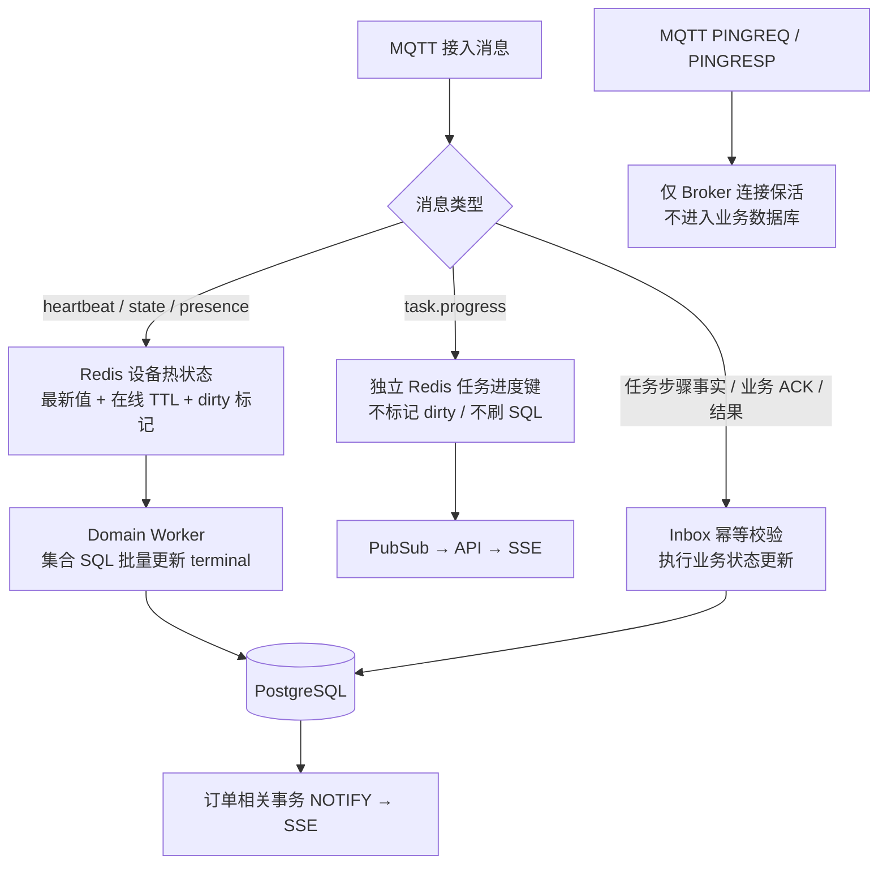

| 数据 | 当前主要存储 | 是否写 PostgreSQL | 是否保留历史 |
| --- | --- | --- | --- |
| MQTT 协议保活报文 | Broker 连接状态 | 否 | 非业务历史 |
| 应用 heartbeat | Redis 热状态 + terminal 投影 | 是，latest 模式批量覆盖；HTTP 兼容路径可能直接更新 | latest 不逐条留心跳历史；audit 可保留 |
| state / presence | Redis + MQTT retained 状态 + terminal 投影 | 是，批量覆盖或降级更新 | 默认最新值 |
| task.progress | Redis 独立任务键与 Pub/Sub | 否，包括 HTTP 进度兼容入口 | 不留进度流水；TTL 1h |
| step.started/completed | 设备事件与任务检查点 | 是 | 按设备事件保留策略清理 |
| 任务成功/失败、命令结果 | Inbox、订单/任务/命令状态 | 是 | 事实及迁移记录 |
| 订单、支付、退款 | PostgreSQL | 是 | 不由遥测清理任务删除 |
| capabilities / inventory | HTTP 同步的 JSON 快照 | 是 | 主要为最新快照；设备仍执行本地物料控制 |
| 设备本地任务与待发消息 | SQLite + 部分 JSON 文件 | 不直接访问云数据库 | 已发送投递记录默认清理 7 天前数据 |

因此，“心跳不存历史”≠“心跳从不写库”；“进度在 Redis”≠“任务完成和支付也放 Redis”。Redis 当前还启用了 AOF，所谓热状态不是保证完全无磁盘 I/O，而是不产生 PostgreSQL 进度历史。

## 9. 订单、任务与命令不是同一个状态

### 图 9：订单主路径（业务示意，不是完整合法迁移表）

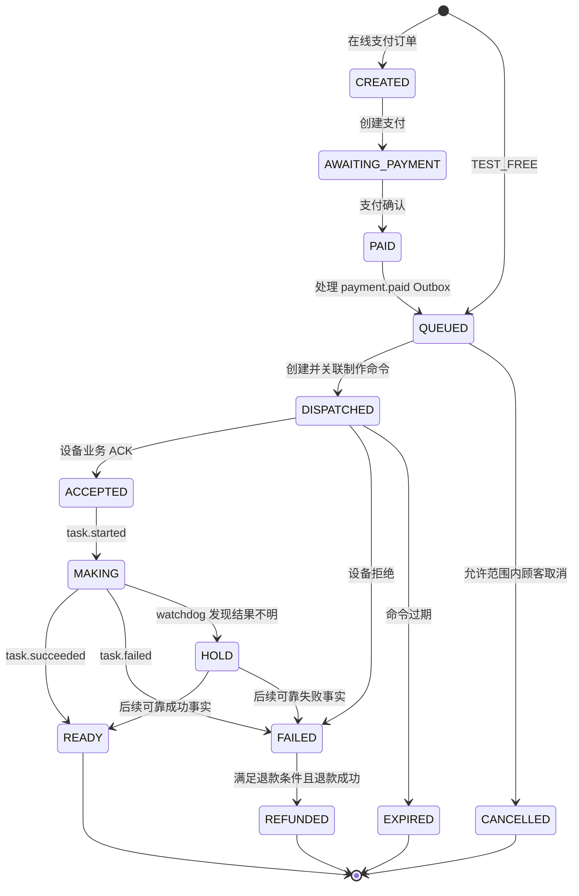

`transition_order()` 主要防重复、保护终态并记录迁移；它没有像命令状态那样枚举所有合法源/目标组合。代码也允许部分设备事件让状态跳过中间阶段，以适应事实补达。上图不能作为完整协议校验器使用。

| 层次 | 例子 | 解释 |
| --- | --- | --- |
| 顾客订单 sales_order | QUEUED / MAKING / READY | 顾客购买流程 |
| 制作任务 production_job | ACCEPTED / EXECUTING / SUCCEEDED / HOLD | 一次制作执行 |
| 云端命令 terminal_command | PUBLISHED / ACKED / EXECUTING / UNKNOWN | 下发与执行确认 |
| 支付 payment | PENDING / PAID / CLOSED / REFUNDING | 资金状态 |
| 设备本地任务 | ACKNOWLEDGED / RUNNING / PAUSED / RETRY_WAIT | 终端运行时状态 |

### 图 10：命令正常路径与不确定状态

```mermaid
stateDiagram-v2
    [*] --> CREATED
    CREATED --> DELIVERING: 领取租约
    DELIVERING --> PUBLISHED: Broker PUBACK
    PUBLISHED --> ACKED: 设备业务接受
    ACKED --> EXECUTING: 开始事件
    EXECUTING --> SUCCEEDED: 成功事实
    PUBLISHED --> REJECTED: 设备拒绝
    EXECUTING --> FAILED: 失败事实
    CREATED --> EXPIRED: 未及时派发
    PUBLISHED --> UNKNOWN: 确认超时
    EXECUTING --> UNKNOWN: 制作超时
    UNKNOWN --> EXECUTING: 补达执行事实
    UNKNOWN --> SUCCEEDED: 补达成功事实
    UNKNOWN --> FAILED: 补达失败事实
    CREATED --> CANCELLED: 取消
```

命令完整合法迁移以 [command_state.py](../../app/command_state.py) 为准；上图省略部分允许的跳转。支付与退款独立迁移规则见 [payment_state.py](../../app/payment_state.py)。

## 10. 核心数据模型

### 图 11：核心实体关系（简化）

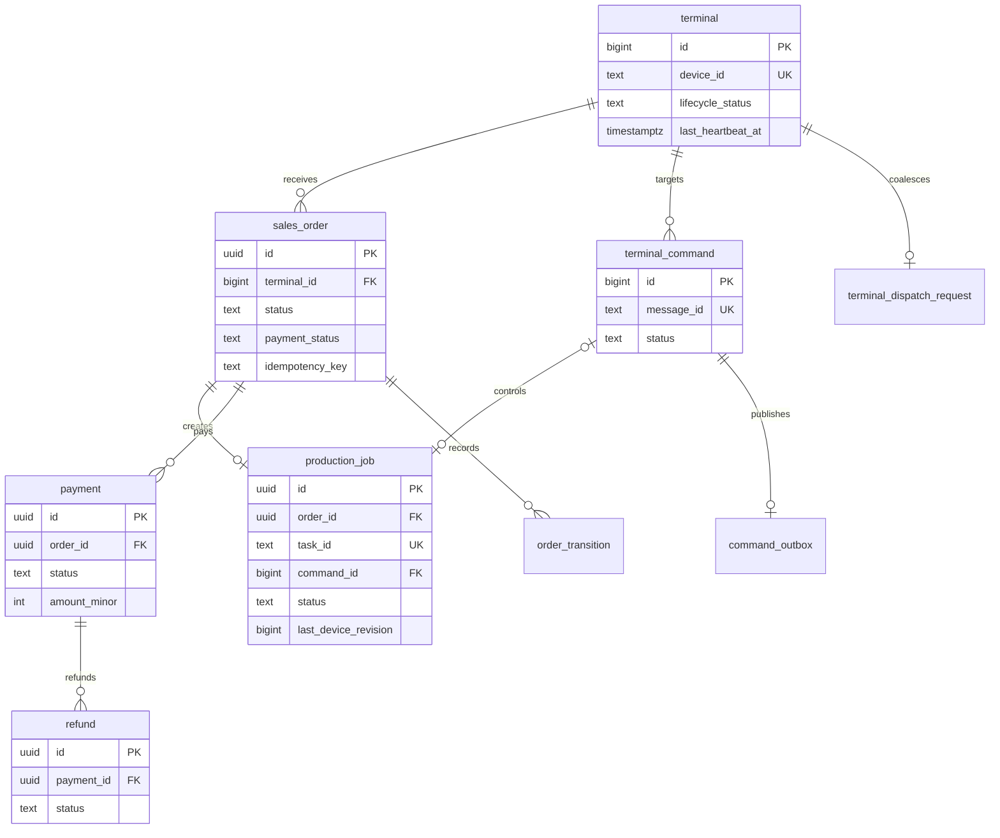

图中省略 device_event、mqtt_inbox、payment_callback_inbox、business_outbox、身份与管理权限表。Outbox/Inbox 是可靠处理机制，不是 Redis 消息队列的另一种名称。

- `business_outbox`：在支付事务中登记后续制作意图。
- `terminal_dispatch_request`：按终端合并派单请求；revision 防止旧请求完成时误删新触发。
- `command_outbox`：待发布命令与租约；可恢复/重试，不能在事务里等待网络 PUBACK。
- `mqtt_inbox` / `device_event`：业务消息去重与处理记录。
- `order_transition`：顾客订单状态轨迹。

数据库定义与迁移以 [database.py](../../app/database.py) 为准，当前功能基线最高 migration 为 9。图表达核心关联，不完整列出所有列与索引。

## 11. 故障与恢复业务逻辑

### 图 12：失败、结果不明与实时通道中断

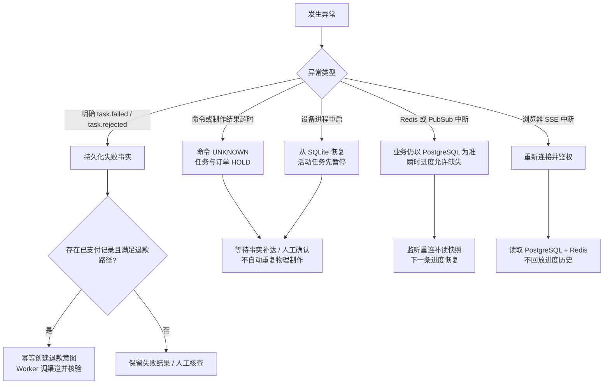

“所有失败都会自动退款”并不成立。当前明确的 `task.failed/task.rejected` 事件路径会尝试为已支付订单创建退款意图；ACK 拒绝、命令过期、watchdog HOLD 等其他路径需逐项确认补偿覆盖，不能仅凭订单变为 FAILED/EXPIRED 推断退款已完成。

此外，Redis dirty 队列当前通过 `ZPOPMIN` 取出后刷库，刷库异常会尝试恢复 dirty；若进程在弹出与提交之间直接崩溃，不是完整的持久租约队列。它承载的是可被后续上报覆盖的设备状态，不适合拿来处理不可丢的支付/制作事实。

## 12. 鉴权与安全边界

| 入口 | 身份/校验 | 边界 |
| --- | --- | --- |
| 顾客订单 | `X-Order-Access-Token` | 只能读取对应订单；SSE 发响应头前先鉴权 |
| 运营后台 | 管理员/运营 Token、角色权限 | 日常运营使用独立可撤销令牌；应急 ADMIN_TOKEN 另计 |
| 设备 HTTP | `X-Device-Id` + Bearer 设备凭证 | 激活、轮换与身份匹配 |
| 设备 MQTT | TLS + 用户凭证 + Topic 权限 | 业务层再次核对 Topic 与 payload 的 deviceId |
| Gateway 内部 HTTP | `X-Gateway-Token` | 网络上内网并不等于无需身份验证 |
| 支付回调 | 渠道验签 + 单号/金额/幂等校验 | 不能由浏览器自报“支付成功” |

需要明确：MQTT 入队 ACK、端到端幂等、设备物理动作安全，是三个层面的保障，不能相互替代。真正接入硬件还需看门狗、互锁、紧急停止、传感器异常处理及不可重复动作的恢复协议；这些不应从模拟器 UI 推断为已完成。

## 13. 当前部署结构与后台并发

本次只读核对：VPS 为 **3 个逻辑 CPU、约 3.82GiB 内存**，同时运行咖啡服务、共享 PostgreSQL、其他 Redis、Forgejo、MinIO 等，并非咖啡系统独占机器。

| 组件 | 当前运行方式 | 资源/连接说明 |
| --- | --- | --- |
| coffee-cloud-mvp | 2 个 Uvicorn Worker | 容器 CPU 上限 1.5 核、内存 768MiB；API 监听回环地址 8788 |
| coffee-mqtt-gateway | 1 进程，4 个上行分片 Worker + 1 命令发布线程 | CPU 上限 1 核、内存 256MiB；内部 HTTP 复用连接 |
| coffee-domain-worker | 1 进程，遥测/领域/支付 3 循环 + 离线扫描线程 | CPU 上限 1 核、内存 512MiB |
| coffee-telemetry-redis | 专用 Redis，回环端口 6380 | 容器 384MiB，Redis maxmemory 256MB，noeviction，AOF 开启 |
| coffee-emqx | MQTT TLS 公网 8883；管理口仅回环 18083 | **当前运行容器未设置 CPU/内存上限**；部署文件虽有上限但尚未应用 |
| postgres-web | 共享 PostgreSQL，回环 5432 | 不由本项目 compose 管理；不可把整台数据库都当成咖啡独占 |
| coffee-db-migrate | tools profile 下的一次性任务 | API/Domain 生产配置不执行启动迁移 |

资源上限之和可以超过 VPS CPU，它们是各容器的封顶值，不是资源预留。当前配置不能据此保证多个服务同时满负荷。

API 的数据库池默认每进程 min=2/max=10；Domain Worker 自己也有连接池。按默认值估算，两个 API + 一个 Domain 的池上限合计 30，另有两个 PG LISTEN 连接，以及迁移、运维和其他应用连接。该值是代码默认预算，不是当前每秒实际连接数。

| 调度项 | 当前代码/配置 |
| --- | --- |
| 设备应用心跳 | 默认 30 秒，首次随机错峰 |
| Gateway 微批 | 每分片最多 100 条或等待约 100ms；生命周期事件不归入可丢进度批次 |
| 设备状态刷库 / 领域循环 / 支付循环 | 默认每轮等待 0.5 秒，处理时间另计 |
| Gateway 命令 Outbox 领取 | 默认 1 秒一次；**不是零轮询** |
| 离线判定 | 默认 90 秒；Redis 在线 TTL 120 秒 |
| SSE 保活 | 15 秒注释帧，不执行 SQL 查询 |
| SSE 通知合并 | 50ms，单订阅队列容量 1 |
| 历史维护 | 默认每小时执行；每表按批清理 |

遥测、领域与支付之间已分线程，但领域循环内部的派单/watchdog/清理仍共用一个线程；支付与退款也共用一个线程。这是有限并发隔离，不是每种任务都有独立进程池。

## 14. 对 1000 台设备的压力分析

应按消息/业务负载估算，而不是只数 MQTT 连接：

| 场景 | 粗略负载 | 当前主要承压组件 |
| --- | --- | --- |
| 1000 台空闲、30 秒心跳 | 平均约 33 条心跳/秒，另加配置刷新 | EMQX、Gateway、Redis、设备状态批量 SQL |
| 1000 台全在制作，若每台平均 5 秒发一次进度 | 约 200 条进度/秒 | Redis + Gateway + SSE，进度本身不刷 SQL |
| 配方较短、5% 阈值更早满足 | 进度频率可能高于上述 200/秒 | 需按真实配方统计，不应称其为上限 |
| 1000 个顾客同时观看各自订单 | 1000 条 SSE 长连接 | API 连接数/内存；不是 1000 个 PG LISTEN |
| 所有设备同时重连/上报 | 短时突发远大于平均值 | Broker、队列、API、身份缓存冷启动 |
| 一批支付超时/退款堆积 | 外部 I/O 与待处理积压 | 支付线程、渠道延迟、重试策略 |

此前记录的本机 `/health` wrk 结果约为：100 并发 2523 RPS；500 并发 2161 RPS；1000 并发 1963 RPS。**这些来自上一轮空载健康接口测试，不是双通道版本的完整设备容量验收，也不包含真实支付、生命周期写库、MQTT 与 SSE 联合负载。** 不能用它直接证明“1000 台全天运营绝对没有问题”。

当前判断：模块方向适合小型 VPS，去掉逐设备订单轮询、实时进度 SQL 写入和浏览器固定订单查询，显著降低了负载放大。但上线承诺仍应通过 [容量与故障验收计划](../capacity-and-fault-test-plan.md) 的 100/500/1000 分档联测。

优先观察 Gateway 队列深度、派单/退款积压、SQL 连接池等待、SSE 重连率与端到端延迟，而不是先把 Python 换成 Rust/C++。目前最值得优先解决的是可验证的协议恢复和共享资源边界。

## 15. 评估结论与维护入口

### 已有优势

1. 制作在设备本地执行，云端网络波动不负责逐步驱动硬件。
2. 订单/支付事实与瞬时进度分开，Redis 不参与资金和订单终态判定。
3. 双通道 SSE 避免按浏览器数量固定轮询数据库。
4. PostgreSQL 连接池、集合写入、Inbox/Outbox、派单 revision 已有明确实现。
5. 模拟器支持独立实例、本地投递队列和重启后保守恢复。

### 必须保留在架构说明中的边界

- 设备 MQTT ACK 到 SQLite 落盘仍有窗口；不承诺 exactly-once 物理执行。
- 订单状态迁移不是完整合法迁移矩阵；暂停/恢复事件的云端映射不完整。
- 异常路径的退款补偿并非所有失败状态自动覆盖。
- 命令 Outbox 领取、展示配置读取、后台扫描仍有周期任务。
- Redis-only 只针对 `task.progress`；设备状态投影仍写 PostgreSQL。
- `/metrics` 的连接池/SSE 数量主要是响应请求的那个 API Worker 的局部值，不能直接当多进程总量。
- `/health` 仅存活，`/ready` 检查数据库并缓存 5 秒；服务 healthy 不等于支付渠道、所有队列和全链路均正常。
- EMQX 配置与运行态资源限制存在差异；本次仅记录，未改生产设置。
- 自动备份仍按用户决定暂不实施；Redis AOF 不是 PostgreSQL 业务备份，也不是已完成的灾备方案。

### 代码阅读顺序

1. [main.py](../../app/main.py) 看入口和依赖组装。
2. [public_orders.py](../../app/services/public_orders.py) 看下单和读模型。
3. [production.py](../../app/services/production.py) 看派单与事件映射。
4. [mqtt_gateway.py](../../app/mqtt_gateway.py) 看 MQTT 接入与命令发布。
5. [order_stream.py](../../app/order_stream.py)、[order_events.py](../../app/order_events.py)、[live_progress.py](../../app/live_progress.py) 看双通道 SSE。
6. [background_worker.py](../../app/services/background_worker.py) 看补偿与后台工作。
7. [模拟器 backend.py](../../../coffee-terminal-simulator/coffee-terminal/backend.py) 看本地接单、执行、上报。
8. [database.py](../../app/database.py)、[repositories/](../../app/repositories/) 看持久化约束。

本文未修改业务代码或运行服务。图表是当前实现的解释材料；后续如修改状态机、数据存储边界、协议或 Worker 拓扑，应同步更新本源文件并重新渲染阅读版。
